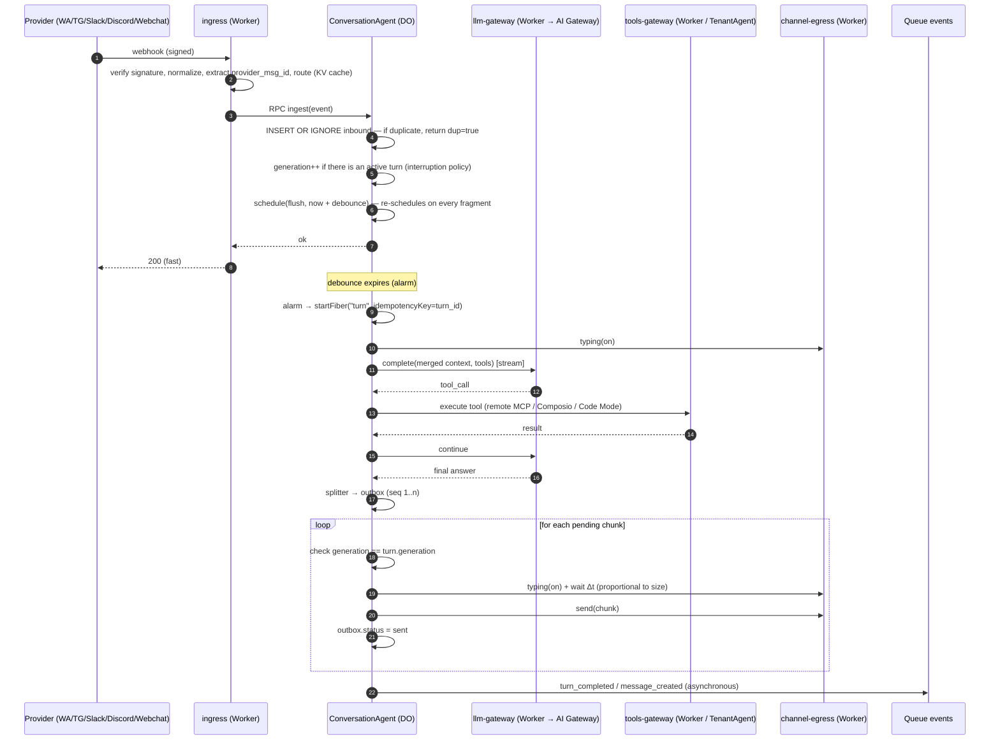

> Research note written on 2026-10-03 for the Kelpie viability study, translated from Portuguese. Corrections across notes are tracked in [00-cross-check.md](00-cross-check.md).

# 05 — Cloudflare: limits, hard constraints and event-driven architecture of the harness

- **Research date:** 2026-10-03 (all pages were read on this date; when the page showed "Last updated", the date appears next to the source).
- **Reference plan:** Workers Paid (US$ 5/month per account).
- **Method:** search of the official documentation with the `search_cloudflare_documentation` tool (Cloudflare MCP). Eight pages on limits, pricing or lifecycle did not appear in the search index and were read directly in the official Markdown version (`developers.cloudflare.com/.../index.md`); this is marked in **Sources**. No generic web search was used for Cloudflare facts.
- **Convention:** anything not confirmed in a Cloudflare doc during this session is marked **(unverified)**. Facts about WhatsApp, Telegram, Discord, Slack, Composio and GitHub are not Cloudflare facts and therefore appear as (unverified).

---

## TL;DR

1. **The platform can carry the harness without containers**, as long as the hot path of the conversation lives in **one Durable Object (DO) per conversation** and not in Queues or Workflows. The DO provides ordering, mutual exclusion, strong SQLite storage and alarms with millisecond precision, which is what the debounced buffer and the paced sending require.
2. **Constraints that reshape requirements:**
   - there is no MCP stdio, `child_process`, git CLI or own browser;
   - the filesystem is ephemeral per request;
   - **one alarm per DO**, with a handler limited to **15 min of wall time**;
   - the DO is evicted after 70–140 s idle, and each pending operation holds it for at most 15 min;
   - **outgoing WebSockets do not hibernate** and bill duration 24/7. This affects the Discord Gateway and Slack Socket Mode (unverified);
   - **6 simultaneous outgoing connections** per invocation;
   - **32 invocations per request** in a chain of service bindings;
   - Queues have no documented ordering;
   - KV is eventually consistent (up to 60 s) with 1 write/s per key;
   - Secrets Store holds **100 secrets per account**;
   - D1 is single-threaded, with 10 GB per database.
3. **Agents SDK (`agents`): use the `Agent` class as the base**, without Think or Messengers as the channel layer. `Agent` provides scheduling multiplexed over the single alarm, `runFiber`/`startFiber` (durable execution with idempotency), a remote MCP client with persisted OAuth, sub-agents and Workflows integration. The harness (buffer, splitter, outbox, cancellation) stays in our own code, behind ports (hexagonal). The SDK changes fast: v0.3.7 in Feb/2026, v0.20 in Jul/2026, `McpAgent` deprecated and `keepAlive` experimental. Therefore: pin versions.
4. **Recommended flow:** `ingress` verifies the signature and normalizes → RPC to the conversation DO, which does `INSERT OR IGNORE` by the provider ID (strong dedupe) and returns 200 → the debounce re-schedules the alarm on every fragment → the turn runs in the DO as a fiber with `keepAlive` → LLM via AI Gateway (retry and fallback) → the splitter writes an **outbox** → the paced sending with "typing" happens in the fiber itself, checking a **generation counter** before each send → events then go through a Queue to projections (Postgres/D1), memory and versioning. A new message during "typing" increments the generation: it cancels the unsent chunks and the in-flight LLM, and merges into the next buffer (configurable policy).
5. **Workflows** are kept for long or multi-step work: agent tasks without a channel, memory consolidation, human-in-the-loop, tool chains longer than a few minutes. **Queues** are kept for asynchronous side effects. The selection criterion is latency and cancellation semantics, not cost.
6. **"Artifacts" exists:** Git-compatible versioned storage, **open beta since 2026-10-01**, billing from **2026-10-14**. However, the documented binding has no write API (writes go through Git smart HTTP), the limit is 1 GB per repo, and the product is in beta. Recommendation: **GitHub as the canonical source**, Artifacts as an optional backend.
7. **Cost of the small scenario, excluding LLM** (1 tenant, 3 agents, 2 thousand messages/day):
   - **≈ US$ 5/month (likely)** on the recommended architecture, with everything inside the included allowances. This depends on a scheduled alarm not preventing hibernation, a point on which the doc is ambiguous (see contradictions).
   - **≈ US$ 18/month** if timers or dangling I/O prevent DO hibernation. The jump comes from the rounding of DO duration, always up to the next 1M GB-s, which means +US$ 12.50.
   - **Under stress, ≈ US$ 30–45/month.** This scenario adds a Discord Gateway in a 24/7 DO, a Workflow per turn and a commit per turn in Artifacts.
   - **With Code Mode on every turn, about +US$ 78/month.** Each piece of LLM-generated code counts as a unique Dynamic Worker per day.

---

## Limits table (Workers Paid)

### Workers (compute)

| Item | Limit / price | Source |
|---|---|---|
| CPU per HTTP request | default 30 s; configurable up to **5 min** (`limits.cpu_ms = 300000`) | [Workers limits](https://developers.cloudflare.com/workers/platform/limits/) (Last updated 2026-09-05) |
| CPU per Cron Trigger | 30 s (interval < 1 h) / 15 min (interval ≥ 1 h) | same |
| HTTP wall time | **unlimited** while the client is connected; `waitUntil()` extends **30 s** after the response or disconnect | same |
| Wall time for Cron / Queue consumer / DO alarm | **15 min** each | same |
| DO wall time (RPC/HTTP) | unlimited while the caller is connected or there is pending I/O | same |
| Workflow step wall time | unlimited (the limit is CPU per step) | same |
| Runtime update | in-flight requests get a **30 s** grace period and are then terminated ("very unlikely") | same |
| Memory | **128 MB** per isolate (JS heap + Wasm) | same |
| Subrequests | 10,000 per invocation (default), configurable up to **10 million** (`limits.subrequests`) | same; [changelog 2026-02-11](https://developers.cloudflare.com/changelog/post/2026-02-11-subrequests-limit/) |
| Simultaneous outgoing connections | **6**; the 7th is queued until one of the 6 receives headers | Workers limits |
| Worker size | **64 MiB** uncompressed, no compressed limit (see contradictions) | same |
| Startup | 1 s | same |
| Workers per account | **500** (for more, Workers for Platforms) | same |
| Cron Triggers per account | 250 | same |
| Environment variables | 128 per Worker, 5 KB each | same |
| Price | US$ 5/month; 10M requests included + US$ 0.30/M; 30M CPU-ms included + US$ 0.02/M CPU-ms; **no duration charge** | [Workers pricing](https://developers.cloudflare.com/workers/platform/pricing/) (Last updated 2026-10-02) |
| Service bindings / RPC | "zero overhead", same thread by default; **no additional request fee** (bills one request plus the summed CPU) | [Service bindings](https://developers.cloudflare.com/workers/runtime-apis/bindings/service-bindings/) (2026-08-18); Workers pricing |
| Service bindings: depth | **maximum of 32 Worker invocations per request**; each call counts toward the subrequest limit; it does not count toward the simultaneous-connections limit | Service bindings |
| Smart Placement | `placement.mode: "smart"`; explicit hints `placement.region` / `placement.host` | [changelog 2026-01-22](https://developers.cloudflare.com/changelog/post/2026-01-22-explicit-placement-hints/); [Hyperdrive FAQ](https://developers.cloudflare.com/hyperdrive/reference/faq/) |
| `nodejs_compat` | on by default from compatibility date **2026-08-04**; `node:fs` is a virtual FS that is **ephemeral per request** | [Node.js APIs](https://developers.cloudflare.com/workers/runtime-apis/nodejs/) (Last updated 2026-08-12); [changelog node:fs](https://developers.cloudflare.com/changelog/post/2025-08-15-nodejs-fs/) |
| Non-functional Node modules (stubs) | `child_process`, `worker_threads`, `cluster`, `vm`, `http2`, `dgram`, `sqlite`, `readline`, `repl`, `tty`, `v8`, `inspector`, `wasi` and others: they import, but throw `[unenv] ... is not implemented yet!` | Node.js APIs |
| Outgoing WebSocket | Workers and DOs can act as a WebSocket client | [DO WebSockets](https://developers.cloudflare.com/durable-objects/best-practices/websockets/) (Last updated 2026-09-30) |

### Durable Objects (SQLite)

| Item | Limit / price | Source |
|---|---|---|
| Number of objects | unlimited | [DO limits](https://developers.cloudflare.com/durable-objects/platform/limits/) (Last updated 2026-06-01) |
| Classes per account | 500 | same |
| Storage per object | **10 GB** | same; [changelog GA](https://developers.cloudflare.com/changelog/post/2025-04-07-sqlite-in-durable-objects-ga/) |
| Storage per account | unlimited (Paid) | DO limits |
| Key + value | ≤ 2 MB; row/string/BLOB ≤ 2 MB; 100 columns; SQL ≤ 100 KB; 100 parameters | same |
| CPU per request | 30 s (default), configurable up to 5 min; **the counter is reset on each HTTP request or incoming WebSocket message** | same |
| Simultaneous outgoing connections | **6** | same |
| Throughput | soft limit of **1,000 req/s per object** | same |
| Incoming WebSocket message | 32 MiB | same |
| Alarms | **one alarm per object**: "Durable Objects only allow one alarm at a time". The Agents SDK multiplexes several schedules in SQL over that single alarm | [Agent class](https://developers.cloudflare.com/agents/runtime/lifecycle/agent-class/) (2026-08-17) |
| Alarm precision | milliseconds; no automatic repetition | [Rules of DO](https://developers.cloudflare.com/durable-objects/best-practices/rules-of-durable-objects/) |
| Alarm semantics | **at-least-once** delivery; retry with exponential backoff starting at 2 s, up to 6 attempts; "in rare cases it fires more than once" (the handler must be idempotent); `ctx.abort({retryAlarm:false})` since 2026-08-25 | [DO Base API](https://developers.cloudflare.com/durable-objects/api/base/); Rules of DO; [changelog 2026-08-25](https://developers.cloudflare.com/changelog/post/2026-08-25-durable-object-alarm-abort-no-retry/) |
| Lifecycle | idle and non-hibernatable: evicted after **70–140 s**. Idle and hibernatable: hibernates after about 10 s. **To hibernate it takes**: no pending `setTimeout`/`setInterval`, no pending I/O or `waitUntil`, no use of the standard WebSocket API and no request/event being processed. **A scheduled storage alarm does not appear among the blockers.** Pending I/O (fetch, RPC, `waitUntil`, timers, outgoing WebSocket/TCP) **prevents eviction for up to 15 min per operation**, and the DO is billed during that time | [DO lifecycle](https://developers.cloudflare.com/durable-objects/concepts/durable-object-lifecycle/) (Last updated 2026-09-30; list of conditions read via WebFetch .md) |
| Uncontrollable evictions | deploys and runtime restarts ("1–2× per day") and alarm handler timeout (15 min) | [Agents: durable execution](https://developers.cloudflare.com/agents/runtime/execution/durable-execution/) (2026-08-20) |
| WebSocket Hibernation | **only when the DO is the server** (`ctx.acceptWebSocket`). "Outgoing WebSockets do not hibernate"; an open outgoing WebSocket prevents eviction for up to 15 min, and the connection "may stay open" after that | DO WebSockets |
| Concurrency | single-threaded with input/output gates; SQLite operations are synchronous (atomic without locks); `blockConcurrencyWhile` has a 30 s timeout and is an antipattern when it spans I/O | [DO State API](https://developers.cloudflare.com/durable-objects/api/state/); Rules of DO |
| PITR | SQLite restore to any point in the last 30 days | [Access DO storage](https://developers.cloudflare.com/durable-objects/best-practices/access-durable-objects-storage/) |
| Price: requests | 1M/month included + **US$ 0.15/M**. Counts HTTP requests, RPC sessions (each method call on the stub is one), WebSocket messages (at a 20:1 ratio) and **alarm invocations** | [DO pricing](https://developers.cloudflare.com/durable-objects/platform/pricing/) (Last updated 2026-09-30) |
| Price: duration | 400,000 GB-s/month included + **US$ 12.50 per 1M GB-s**; always billed at 128 MB; **the overage is rounded up to the next unit (1M GB-s)**; an idle DO eligible to hibernate pays no duration | same |
| Price: SQLite | rows read: 25 bn/month included + US$ 0.001/M; rows written: 50M included + US$ 1.00/M (each `setAlarm()` counts as 1 row written); storage: 5 GB-month + US$ 0.20/GB-month (billing active since Jan/2026) | same; [changelog SQLite billing](https://developers.cloudflare.com/changelog/post/2025-12-12-durable-objects-sqlite-storage-billing/) |

### Queues

| Item | Limit / price | Source |
|---|---|---|
| Queues per account | 10,000 | [Queues limits](https://developers.cloudflare.com/queues/platform/limits/) (Last updated 2026-04-21) |
| Message size | 128 KB | same |
| Retries | up to 100 per message | same |
| Consumer batch | up to 100 messages; maximum wait of 60 s | same |
| `sendBatch` | 100 messages or 256 KB | same |
| Throughput | **5,000 msg/s per queue** | same |
| Backlog | 25 GB per queue | same |
| Retention | default 4 days, configurable up to 14 | same; Workers pricing |
| Concurrent consumers | 250 (push) | Queues limits |
| Consumer | 15 min wall; CPU up to 5 min | same |
| **Delivery delay** | `delaySeconds` from **0 to 86,400 (24 h)**, on send or on retry; also a default `retry_delay` per consumer | same; [Queues JS APIs](https://developers.cloudflare.com/queues/configuration/javascript-apis/) |
| Delivery guarantee | **at-least-once** (rare duplicates) | [Delivery guarantees](https://developers.cloudflare.com/queues/reference/delivery-guarantees/) (Last updated 2026-04-21) |
| **Ordering** | **the doc does not document an ordering guarantee**: treat as unordered | same |
| DLQ | `dead_letter_queue` on the consumer; without a DLQ, the message is **dropped** after `max_retries` | [Wrangler config](https://developers.cloudflare.com/workers/wrangler/configuration/) |
| Price | 1M operations/month included + **US$ 0.40/M**; one operation per 64 KB block; about 3 operations per message (write, read, delete); each retry adds a read | Workers pricing |

### Workflows

| Item | Limit / price | Source |
|---|---|---|
| Steps per instance | 10,000 (default), configurable up to **25,000**; `step.sleep` **does not count** toward this limit | [Workflows limits](https://developers.cloudflare.com/workflows/reference/limits/); [changelog 2026-03-03](https://developers.cloudflare.com/changelog/post/2026-03-03-step-limits-to-25k/) |
| Step result | 1 MiB (non-stream); event payload: 1 MiB | Workflows limits |
| Persisted state | 1 GB per instance | same |
| `step.sleep` | up to **365 days** | same |
| `waitForEvent` | default timeout of **24 h** | [Workflows Workers API](https://developers.cloudflare.com/workflows/build/workers-api/) |
| Step timeout | recommendation: ≤ 30 min (above that, use `waitForEvent`) | [Rules of Workflows](https://developers.cloudflare.com/workflows/build/rules-of-workflows/) |
| CPU per step | 30 s (default) / 5 min; wall unlimited | Workflows limits |
| Concurrent instances | **50,000 per account** (table) **vs. 10,000** (text of the same page): see contradictions. Instances in `waiting` do not count | same |
| Creation | 300/s per account; 100/s per workflow | same |
| Retries per step | up to 10,000 | same |
| Price | requests and CPU at Workers Standard rates; **steps: 500k/month included + US$ 0.80 per 100k**; storage: 1 GB-month + US$ 0.20/GB-month. Billing of steps and storage from **2026-08-10** (at the earliest). **`sleep` and `waitForEvent` count as billable steps**; retries and rollback do not count | [Workflows pricing](https://developers.cloudflare.com/workflows/reference/pricing/) (Last updated 2026-09-21); [changelog 2026-07-07](https://developers.cloudflare.com/changelog/post/2026-07-07-workflows-billing-updates/) |

### Agents SDK (`agents` package) — confirmed capabilities

| Capability | What the doc says | Source |
|---|---|---|
| Base | `DurableObject` > `Server` > `Agent` > `AIChatAgent` | [Agent class](https://developers.cloudflare.com/agents/runtime/lifecycle/agent-class/) |
| Scheduling | `schedule()` accepts a delay, `Date` or cron; several schedules in SQL over a single alarm; `idempotent` since v0.8.0 | Agent class; [v0.8.0](https://developers.cloudflare.com/changelog/post/2026-03-23-agents-sdk-v0.8.0/) |
| Internal queue | `this.queue()`: tasks in `cf_agents_queues`, executed in sequence | Agent class |
| Durable execution | `runFiber()` (checkpoint with `stash()`, `onFiberRecovered`); `startFiber()` with **`idempotencyKey`** for durable acceptance of webhooks; `keepAlive()` (30 s heartbeat, **@experimental**) | [Durable execution](https://developers.cloudflare.com/agents/runtime/execution/durable-execution/) (2026-08-20); [Agents changelog](https://developers.cloudflare.com/changelog/product/agents/) |
| Sub-agents | `subAgent()`: co-located facets with their own SQLite and typed RPC; **facets have no alarm of their own** (the parent owns the physical alarm and routes) | [Sub-agents](https://developers.cloudflare.com/agents/runtime/execution/sub-agents/) (2026-09-15) |
| Agents as tools | `agentTool()` and `runAgentTool` (including in the background, since v0.17) | [v0.17.0](https://developers.cloudflare.com/changelog/post/2026-06-26-agents-sdk-v0.17.0/); [Agents API](https://developers.cloudflare.com/agents/runtime/agents-api/) |
| MCP client | `addMcpServer()` for remote servers, with automatic OAuth; tokens and connections persisted in the agent's SQLite; MCP SDK v2 in Agents SDK v0.20.0 | [McpClient API](https://developers.cloudflare.com/agents/model-context-protocol/apis/client-api/) (2026-07-27) |
| MCP server | `McpAgent` **deprecated and frozen**; migrate to stateless handlers (`createMcpHandler`) | [McpAgent](https://developers.cloudflare.com/agents/model-context-protocol/apis/agent-api/) (2026-07-27) |
| Workflows | `AgentWorkflow`, `runWorkflow()`, `waitForApproval()`, `approveWorkflow()`/`rejectWorkflow()`, `reportProgress()` | [Run Workflows](https://developers.cloudflare.com/agents/runtime/execution/run-workflows/) |
| Chat | `AIChatAgent`: persistence, resumable streaming, client-side tools and HITL, stream recovery after eviction | [Chat agents](https://developers.cloudflare.com/agents/communication-channels/chat/chat-agents/) |
| Think | `@cloudflare/think`: opinionated harness (tree sessions, compaction, FTS5, LLM-editable memory); **Messengers: Telegram only for now**, with streaming delivery (posts and edits); **Channels API experimental** | [Think](https://developers.cloudflare.com/agents/harnesses/think/) (2026-08-20); [Messengers](https://developers.cloudflare.com/agents/harnesses/think/messengers/); [Channels](https://developers.cloudflare.com/agents/harnesses/think/channels/) |
| AI SDK | support for `ai@^6 \|\| ^7` | [changelog 2026-07-23](https://developers.cloudflare.com/changelog/post/2026-07-23-ai-sdk-v6-v7-support/) |
| Code Mode | `@cloudflare/codemode` on top of Dynamic Workers: **experimental** | [Code Mode MCP server](https://developers.cloudflare.com/agents/model-context-protocol/guides/build-codemode-mcp-server/) |

### Storage and data

| Product | Limits / price | Source |
|---|---|---|
| **KV** | **eventual** consistency: writes visible in other locations within up to **60 s** (or `cacheTtl`); **1 write/s per key** (429); last-write-wins; 1,000 namespaces | [KV write](https://developers.cloudflare.com/kv/api/write-key-value-pairs/); [changelog namespaces](https://developers.cloudflare.com/changelog/post/2025-01-27-kv-increased-namespaces-limits/) |
| KV: price | reads: 10M + US$ 0.50/M; writes, deletes and lists: 1M + US$ 5.00/M each; storage: 1 GB + US$ 0.50/GB-month | Workers pricing |
| **R2** | event notifications **to Queues** (`object-create`, `object-delete`, prefix and suffix filters); object up to 5 TiB; 1,024-byte key; 8 KiB metadata; up to 1M buckets | [wrangler r2 notification](https://developers.cloudflare.com/workers/wrangler/commands/r2/); [R2 limits](https://developers.cloudflare.com/r2/platform/limits/) |
| R2: object versioning | **not found in the doc** (no page on object versioning; treat as nonexistent) | — |
| R2: price | US$ 0.015/GB-month; Class A: US$ 4.50/M; Class B: US$ 0.36/M; free tier of 10 GB-month, 1M Class A and 10M Class B; free egress | [R2 pricing](https://developers.cloudflare.com/r2/pricing/) (Last updated 2026-10-01) |
| **D1** | 50,000 databases per account; **10 GB per database**; 1 TB per account; **1,000 queries per invocation**; 30 s per query; **single-threaded** (a 1 ms query ≈ 1,000 qps; a 100 ms query ≈ 10 qps); 30-day Time Travel. Writes are serialized on a single primary (read replication at no extra cost) | [D1 limits](https://developers.cloudflare.com/d1/platform/limits/) (Last updated 2026-04-21); Workers pricing |
| D1: price | rows read: 25 bn + US$ 0.001/M; rows written: 50M + US$ 1.00/M; storage: 5 GB + US$ 0.75/GB-month | Workers pricing |
| **Hyperdrive** | Postgres and MySQL (and compatibles: CockroachDB, Timescale, PlanetScale, MariaDB…); 25 configurations per account; queries of up to 60 s; response cache of up to 50 MB; **unlimited queries on Paid**, pooling and cache included | [Hyperdrive limits](https://developers.cloudflare.com/hyperdrive/platform/limits/); [Hyperdrive pricing](https://developers.cloudflare.com/hyperdrive/platform/pricing/); [Supported DBs](https://developers.cloudflare.com/hyperdrive/reference/supported-databases-and-features/) |
| **Vectorize** | **20M vectors per index**; 1,536 float32 dimensions; 50,000 indexes; 50,000 namespaces per index; topK 50 (with metadata) or 100 (without); 10 KiB of metadata; 10 metadata indexes | [Vectorize limits](https://developers.cloudflare.com/vectorize/platform/limits/) (2026-08-05); [changelog 20M](https://developers.cloudflare.com/changelog/post/2026-08-04-index-capacity-20-million/) |
| Vectorize: price | queried dimensions: 50M + US$ 0.01/M; stored dimensions: 10M + US$ 0.05 per 100M | Workers pricing |
| **Artifacts** | **open beta (2026-10-01)**, Paid only; billing from **2026-10-14**; repo of up to 1 GB; file of up to 32 MB; 1 TB per account; 2,000 req/10 s per repo; unlimited repos | [Artifacts](https://developers.cloudflare.com/artifacts/) (2026-10-01); [Artifacts limits](https://developers.cloudflare.com/artifacts/platform/limits/); [changelog open beta](https://developers.cloudflare.com/changelog/post/2026-10-01-artifacts-open-beta/) |
| Artifacts: API | binding with create, import, fork, delete, info, `readFile`, commit history and per-repo tokens. **The documented binding has no commit/write method**: writes go through Git smart HTTP (data plane). There are also events (push, clone…) and a choice of US/EU region | [Workers binding](https://developers.cloudflare.com/artifacts/api/workers-binding/); [Repositories](https://developers.cloudflare.com/artifacts/concepts/repositories/) |
| Artifacts: price | operations: 10,000/month included + US$ 0.15 per 1,000; storage: 1 GB + US$ 0.50/GB-month | [Artifacts pricing](https://developers.cloudflare.com/artifacts/platform/pricing/) (Last updated 2026-10-01) |

### AI

| Product | Limits / price | Source |
|---|---|---|
| **AI Gateway** | core functions free (analytics, cache, rate limit); unified REST API at `api.cloudflare.com` (`/ai/run`, `/ai/v1/chat/completions`, `/ai/v1/responses`, `/ai/v1/messages`); OpenAI-compatible `/compat` endpoint; **BYOK** (stored keys) or Unified Billing (with a limit of 200 req/60 s per gateway); "Require provider credentials" option (2026-09-14); **automatic retry** of up to 5 attempts (100 ms–5 s, with backoff); **fallback** via Dynamic Routing; **spend limits**; free guardrails and DLP; cache with TTL of up to 1 month and a cacheable request of up to 25 MB; 20 gateways (Paid) | [AI GW pricing](https://developers.cloudflare.com/ai-gateway/reference/pricing/) (2026-09-24); [AI GW limits](https://developers.cloudflare.com/ai-gateway/reference/limits/); [changelog AI GW](https://developers.cloudflare.com/changelog/product/ai-gateway/); [Unified Billing](https://developers.cloudflare.com/ai-gateway/features/unified-billing/) |
| AI Gateway: logs | customers who create their first gateway from 2026-09-24 onward follow Workers Logs/Observability pricing; the `cf-aig-collect-log-payload: false` header records metadata only | same; [AI GW logging](https://developers.cloudflare.com/ai-gateway/observability/logging/) |
| **Workers AI** | US$ 0.011 per 1,000 neurons; 10,000 neurons/day free. Embeddings: `bge-m3` and `qwen3-embedding-0.6b` at US$ 0.012/M tokens; `bge-base-en-v1.5` at US$ 0.067/M | [Workers AI pricing](https://developers.cloudflare.com/workers-ai/platform/pricing/) (Last updated 2026-10-01) |

### Platform, sandbox and browser

| Product | Limits / price | Source |
|---|---|---|
| **Secrets Store** | open beta; **100 secrets per account; 1 store per account**; secret of up to 65,536 bytes; per-service scopes | [Manage secrets](https://developers.cloudflare.com/secrets-store/manage-secrets/) (2026-09-25) |
| **Workers for Platforms** | US$ 25/month; 20M requests; 60M CPU-ms; 1,000 scripts + US$ 0.02/script; maximum CPU of 30 s per invocation (according to the pricing page) | [WfP pricing](https://developers.cloudflare.com/cloudflare-for-platforms/workers-for-platforms/platform/pricing/) (Last updated 2026-04-21) |
| **Dynamic Workers** (Worker Loader) | **open beta** (2026-03-24), Paid only; `load()` (single execution) and `get(id)` ("hot" cache); `globalOutbound: null` or an interceptor (egress control); custom `cpuMs` and `subRequests` limits; one DO can have up to 10 distinct Dynamic Workers in flight (other Workers, 4) | [Dynamic Workers API](https://developers.cloudflare.com/dynamic-workers/api-reference/); [changelog open beta](https://developers.cloudflare.com/changelog/post/2026-03-24-dynamic-workers-open-beta/); [changelog 2026-08-28](https://developers.cloudflare.com/changelog/post/2026-08-28-durable-objects-dynamic-workers-limit/) |
| Dynamic Workers: price | 1,000 unique Dynamic Workers/month included + **US$ 0.002 per Dynamic Worker per day**; unique = **Worker ID + code** (if the code changes, it is a new one); billed since 2026-05-26 | [Dynamic Workers pricing](https://developers.cloudflare.com/dynamic-workers/pricing/) |
| **Browser Run** (formerly Browser Rendering, renamed on 2026-04-15) | Paid: 200 concurrent browsers; 3 new/s; Quick Actions at 30 req/s (2026-08-20). Price: 10 h/month + US$ 0.09 per browser hour; sessions: 10 concurrent (monthly average) + US$ 2.00 per additional concurrent browser | [changelog limits](https://developers.cloudflare.com/changelog/post/2026-08-20-limits-increase/); [Browser Run limits](https://developers.cloudflare.com/browser-run/limits/) (2026-09-26); [changelog pricing 2025-07-28](https://developers.cloudflare.com/changelog/post/2025-07-28-br-pricing/) (price read in the changelog; confirm on the pricing page) |

### Observability

| Product | Limits / price | Source |
|---|---|---|
| **Workers Logs** | until 2026-11-30: 20M events/month + US$ 0.60/M, 7-day retention. **From 2026-12-01: Cloudflare Observability pricing** | [Workers Logs](https://developers.cloudflare.com/workers/observability/logs/workers-logs/) |
| **Cloudflare Observability** (from 2026-12-01) | ingestion: 50 GB included + **US$ 0.25/GB**; storage: 12 GB-month included + **US$ 0.10/GB-month**; default retention of 7 days. Covers Workers Logs, Workers Traces, AI Gateway logs and R2 Data Access Logs | [Observability pricing](https://developers.cloudflare.com/observability/pricing/) (Last updated 2026-10-02; values taken from the page's example) |
| **Traces** | Workers Traces with 7-day retention; OTel export (`persist: false` avoids storing on Cloudflare); `head_sampling_rate` | [Traces](https://developers.cloudflare.com/workers/observability/traces/); [OTel export](https://developers.cloudflare.com/workers/observability/opentelemetry-export/) |
| **Analytics Engine** | blobs of up to 16 KB per data point; query via SQL API. **Price: unverified** (not found in this session) | [changelog blobs](https://developers.cloudflare.com/changelog/post/2025-06-20-increased-blob-size-limits-in-Workers-Analytics/) |
| **Pipelines** | stream → SQL → R2 (JSON, Parquet or Iceberg). Free ingress; transform: US$ 0.04/GB; sink: US$ 0.03/GB (JSON) or US$ 0.06/GB (Parquet/Iceberg); 50 GB/month included. **Billing not yet enabled** | [changelog Pipelines pricing](https://developers.cloudflare.com/changelog/product/basin/) |

### Contradictions found in the docs themselves

| Topic | Value A | Value B | How I handled it |
|---|---|---|---|
| Workflows concurrency | table: **50,000** running instances per account | text of the same page: "**10,000** concurrent instance limit" | plan for 10,000 (the conservative one) |
| Worker size | Workers limits (2026-09-05): **64 MiB** uncompressed | Workflows limits: "10MB max script size (Paid) per Worker size limits" | the Workers page prevails, being more recent; it does not depend on this |
| Service binding and subrequests | Service bindings: "Each request to a Worker via a Service binding counts toward your subrequest limit" | Workers limits: service bindings "without consuming the fetch quota" | assume it counts (the conservative one); at 10k/invocation, irrelevant here |
| KV: operations per invocation | KV read: "Workers are limited to 1,000 operations to external services per invocation" | Workers limits (since 2026-02-11): 10,000 subrequests, configurable to 10M | the KV text predates the change |
| DO alarm and hibernation | DO WebSockets: "Events such as alarms, incoming requests, and scheduled callbacks prevent hibernation. This includes `setTimeout` and `setInterval`." | DO lifecycle (2026-09-30): the conditions to hibernate (no timers, no pending I/O or `waitUntil`, no standard WebSocket API, no event being processed) **do not include** a scheduled alarm | likely reading: the alarm **firing** prevents hibernation and the **scheduled** alarm does not. This is the premise of the US$ 5 baseline cost; the US$ 18 case covers the other reading. Confirm with duration metrics in the dashboard |

---

## Hard constraints and adaptations

| # | Constraint (source above) | What it kills or reshapes | Adaptation |
|---|---|---|---|
| R1 | **No containers**: `child_process`, `worker_threads` and the like are stubs that throw an error | **MCP stdio** (local servers via `npx`); git CLI; native binaries; own headless browser | **Remote MCP** only (Streamable HTTP) via the Agents SDK client; Composio through its HTTP API (unverified); browsing via **Browser Run**; code execution via **Dynamic Workers** (JS; Python is slow to start); git via the GitHub REST API (unverified) or Artifacts' Git smart HTTP with a JS client (working inside a Worker is unverified) |
| R2 | **No persistent filesystem**: `node:fs` is ephemeral per request | Skills and `.md` memory "on disk"; agent workspace | Source of truth on GitHub (or Artifacts); read cache in R2/KV and in the DO's SQLite; the context loads the `.md` files on demand, by index |
| R3 | **Outgoing WebSocket does not hibernate** and holds the DO for at most 15 min per operation; duration is billed while the DO cannot hibernate | Channels that require a persistent client socket: **Discord Gateway** for message events, **Slack Socket Mode**, unofficial WhatsApp libraries (all unverified) | Prefer **webhooks**: WhatsApp Cloud API, Telegram webhook, Slack Events API, Discord Interactions (unverified). If Discord requires the Gateway: a dedicated "gateway" DO per bot/shard, accepting the cost (**1 DO 24/7 at 128 MB ≈ 2,592,000 s × 0.125 GB = 324,000 GB-s/month ≈ 81% of the 400k included**), with reconnection by alarm. Keeping the socket open for more than 15 min beyond the documented window is (unverified) and needs a test |
| R4 | **One alarm per DO**; **alarm handler limited to 15 min of wall time**; at-least-once alarm | Debounce, paced sending, "typing" renewal, retries and reminders in the same object. A long turn inside `alarm()` dies at 15 min | Multiplex the schedules in a SQL table (`Agent.schedule()` already does this). The alarm only **starts** the turn (fiber); tool chains longer than a few minutes go to a **Workflow**. Idempotent handlers, guarded by `turn_id`/`generation` |
| R5 | **DO eviction**: 70–140 s idle; deploys 1–2×/day; 15 min per pending operation | A long LLM call or a stream can be cut midway; in-memory state is lost | `runFiber`/`startFiber` with `stash()` at checkpoints; `keepAlive` during the LLM; **persisted outbox**: on recovery, only resend chunks with `pending` status and never duplicate a `sent` chunk |
| R6 | **6 simultaneous outgoing connections** per invocation or DO | Tool parallelism + LLM stream + channel send + "typing" renewal get queued | Limit tool fan-out to 3–4 in parallel; renew "typing" in the same send slot; delegate large fan-out to sub-agents or a Workflow (the per-facet limit is unverified) |
| R7 | **32 invocations per request** in a chain of service bindings | Deep chains: `ingress → runtime → llm-gw → tools-gw → …` and an agent calling an agent calling an agent | Shallow chains (≤ 4 hops). Agents that orchestrate agents do so via **DO RPC** from the DO (each call is a new session), or asynchronously via Queue/Workflow. Whether DO RPC counts toward the limit of 32 is (unverified) |
| R8 | **30 s CPU per request/event** (up to 5 min) and **128 MB** per isolate | Giant prompt assembly, local tokenization, parsing of large attachments, whole histories in memory | Configure `cpu_ms`; streaming; paginated and summarized context; attachments in R2, processed by a Workflow step |
| R9 | **Queues with no documented ordering** + at-least-once; delay of at most 24 h | Using a Queue between the webhook and the LLM breaks fragment ordering and duplicates | Ordering is guaranteed by the **conversation DO** (single-threaded). Queue only for idempotent side effects: projections, memory, versioning, analytics |
| R10 | **KV eventual (up to 60 s)** and 1 write/s per key | Dedupe, locks, counters and conversation state in KV | KV **only** for configuration cache and routing (channel → tenant/agent). Dedupe via `UNIQUE` in the DO's SQLite |
| R11 | **D1 single-threaded**, 10 GB/database, 1,000 queries per invocation | D1 as the main multi-tenant database for messages and analytics | D1 for the light control plane (optional). Hot state in DO SQLite. Cross-tenant relational data and admin search in **Postgres via Hyperdrive** (requirement 8). Analytical events in Analytics Engine or Pipelines → R2/Iceberg |
| R12 | **Secrets Store: 100 secrets and 1 store per account** (beta). **AI Gateway BYOK is not per tenant**: on the unified endpoints (`/ai/v1/chat/completions`, `env.AI.run()`) only the key of the `default` alias is consulted; aliases (`cf-aig-byok-alias`) apply only to passthrough requests to the provider; and the limit is **20 gateways per account** | **Per-tenant** channel tokens, LLM keys and MCP OAuth; one gateway per tenant | **Envelope encryption** (AES-GCM via WebCrypto): one KEK in Secrets Store/Worker secret, DEKs per tenant, ciphertext in the DO/D1/Postgres. For the LLM: the `llm-gateway` decrypts the tenant's key and sends it **on each request** (the key in the request takes precedence), or uses passthrough with an alias. Turn on **`byok_only`** ("Require provider credentials", 2026-09-14), so that a missing key returns 400 instead of falling back to Unified Billing. One shared gateway, with the tenant in custom metadata for spend limits and logs |
| R13 | **Sub-agents have no alarm of their own** (the parent routes) + **soft limit of 1,000 req/s per object** | A global (or per-tenant) root DO as the parent of all conversations becomes an alarm bottleneck | **Conversation as a top-level DO** (own alarm). The agent DO is keyed by `(tenant, agent)`. Sub-agents only for orchestration within a task |
| R14 | **Workers per account: 500** | One Worker per tenant or per agent | Tenants are **data**, not code. Workers for Platforms only if the tenant can upload its own code |
| R15 | **Workflows**: 1 MiB step result; `sleep` and `waitForEvent` billed as steps; creation at 100/s per workflow | A Workflow per message as the "conversation engine" at scale | A Workflow per **long task**, not per message; payloads in R2 with a reference in the step |
| R16 | **Dynamic Workers**: the unique code defines the Worker billed per day (US$ 0.002 each, above 1,000/month) | Code Mode on every turn (the LLM-generated code is always new) | Code Mode only on turns that justify it. "Promoted" tools with stable code and `get(id)` |
| R17 | **Artifacts** in beta; the binding has no write; 1 GB per repo | Basing versioned memory on a beta product with writes via Git over HTTP | **Canonical GitHub** via REST, which is visible in the portfolio. Artifacts as an optional adapter behind the same `ContextStore` port |
| R18 | **`waitUntil` lasts only 30 s** after the response; providers retry webhooks | Processing the turn before the 200, or in `waitUntil` | Persist in the DO (ms) → 200 → the rest is asynchronous in the DO (alarm and fiber) |
| R19 | **Runtime update**: 30 s grace for in-flight requests | LLM streaming in progress during the deploy | Covered by R5 (fiber + outbox) |

---

## Agents SDK: use it or not

### Verdict
**Use the `Agent` class (`agents` package) as the base of the conversation and agent DOs**, with a pinned version and encapsulated behind our own ports. **Do not** adopt Think or Messengers as the channel layer at this time. `AIChatAgent` is optional, only for the webchat.

### Why (with evidence)

| In favor of using `Agent` | Evidence |
|---|---|
| Solves the **single alarm**: multiple, idempotent schedules with cron | Agent class; v0.8.0 |
| **Durable execution** ready-made: `runFiber`/`stash`/`onFiberRecovered`, and `startFiber` with `idempotencyKey`, which serves for webhook dedupe and for "accept and reply later" | Durable execution |
| **Remote MCP client** with OAuth and persistence, which greatly reduces the work of the tools gateway | McpClient API |
| **Sub-agents** and **agents as tools** meet the "agents orchestrating agents" requirement | Sub-agents; v0.17.0 |
| **Workflows integration** (HITL with `waitForApproval`) | Run Workflows |
| WebSocket state sync for the management UI (`useAgent`), plus integrated tracing | Agents API; Think (tracing) |
| For a portfolio repo, shows fluency in the platform's current stack | — |

| Against / risks | Evidence | Mitigation |
|---|---|---|
| **Fast change**: v0.3.7 (Feb/2026) → v0.20 (Jul/2026), migration to MCP SDK v2, `McpAgent` deprecated | changelogs; McpAgent | Pin versions; contract tests on the ports; one ADR per upgrade |
| `keepAlive` **@experimental**; Code Mode and Think Channels **experimental** | Agents changelog; Code Mode; Channels | Use `runFiber` (stable in the doc) as the main mechanism; `keepAlive` behind an adapter |
| **Think Messengers** has only Telegram, and delivery is streaming with message editing: conflicts with requirement (2), **separate** and paced messages with "typing" | Messengers | Own channel layer (adapters per channel) |
| Think imposes its own memory model (context blocks and sessions), which competes with the versioned `.md` memory (requirement 4) | Think | Own harness on top of `Agent` plus the AI SDK; re-evaluate Think after the MVP |
| Facets without their own alarm may concentrate alarms in the parent DO | Sub-agents | Top-level conversations (R13) |

### Pure own DOs vs. `Agent`
- **Pure DO:** full control and fewer dependencies, but you must reimplement the multiplexed scheduler, fiber recovery, MCP OAuth and WebSocket routing. That is a lot of infrastructure code, with no differentiator for the portfolio.
- **`Agent`:** speeds up the infrastructure. The project's differentiator (buffer, splitter, outbox, interruption policy, multi-tenant, versioned memory) remains our own, testable code.
- **Design:** `ConversationAgent extends Agent` and `TenantAgent extends Agent`. The domain lives in pure modules (`Buffer`, `TurnPlanner`, `Splitter`, `Outbox`, `InterruptPolicy`) with no `agents` import, which makes it possible to swap the base if the SDK breaks.

---

## Proposed event-driven flow

### Keys and objects
- `ConversationAgent` (top-level DO) named `conv:{tenantId}:{agentId}:{channel}:{threadId}`. It owns: messages, buffer, turns, outbox, `generation`, fibers.
- `TenantAgent` (DO) named `agent:{tenantId}:{agentId}`. It owns: versioned config, MCP connections and OAuth, memory index and budget.
- SQLite tables in the `ConversationAgent`:
  - `inbound(provider_msg_id UNIQUE, ts_provider, payload, turn_id NULL)`;
  - `turns(id, generation, status, started_at)`;
  - `outbox(turn_id, seq, text, status[pending|sent|cancelled], send_after_ms)`;
  - `state(k, v)`.

### Sequence (happy path)

### Step by step and decisions

1. **Webhook → ingress.** Validates the signature (the channel secret is decrypted via the KEK). Normalizes to `CanonicalEvent {tenant, agent, channel, thread, provider_msg_id, ts, author, parts[]}`. Resolves routing with a KV cache (short TTL; the source is D1/Postgres). **Status** events (delivered/read) are filtered here and go to Analytics Engine, without waking the DO. This matters because WhatsApp sends several statuses per message sent (unverified).
2. **Dedupe and idempotency.** It is done **in the DO**, with `INSERT OR IGNORE` on `UNIQUE(provider_msg_id)`, which is strong and transactional. The ingress answers 200 for both a new and a duplicate message. If the RPC to the DO fails, it returns 5xx and the provider retries: the **provider is the retry mechanism**, and the dedupe absorbs it. For Slack, which requires a fast response (about 3 s, unverified), the synchronous path is only to persist.
3. **Buffer with debounce.** Each fragment re-schedules `flush` to `now + debounce`, with an adaptive debounce:
   - 2–4 s by default;
   - shorter when the message ends with final punctuation;
   - longer when the user is "typing", if the channel reports it (unverified).
   
   A cap (`max_wait`, for example 15 s) avoids waiting forever. When merging, sort by `ts_provider` and then by arrival order (webhooks can arrive out of order).

   The debounce must be an **alarm** (`schedule`), never `setTimeout`. A pending timer prevents hibernation and keeps duration being billed; a scheduled alarm is not among the blockers listed in the lifecycle.
4. **Turn processing: DO vs. Queue vs. Workflow.**

   | Option | Pros | Cons | Use |
   |---|---|---|---|
   | **DO + fiber** (recommended) | minimal latency; state, ordering and cancellation in the same place; no extra hop | eviction (mitigated by fiber and outbox); alarm limited to 15 min; 6 connections | **hot path of every chat turn** |
   | Queue consumer | absorbs spikes; retry and DLQ | **no documented ordering**; at-least-once; still needs a lock (the DO); +batch latency | side effects (memory, projection, versioning) |
   | Workflow | per-step retry; unlimited wall per step; `sleep` up to 365 days; HITL | per-step latency (unverified); cancelling = terminating the instance; **about 10 billable steps per turn** (sleep counts) = 400k/month in the scenario, close to the 500k included; 1 MiB per step | long agent tasks, agents without a channel, memory consolidation, multi-minute tool chains, human approval |

5. **LLM with tools.** Via `llm-gateway` → AI Gateway: the tenant's key sent on each request with `byok_only` turned on (R12), automatic retry (up to 5 attempts), fallback via Dynamic Routing, cache and spend limits per `tenant` (custom metadata). The stream returns to the DO via RPC (`ReadableStream`). Tool fan-out is limited to 3–4 in parallel (R6). For long tool chains, the DO triggers an `AgentWorkflow` and receives `onWorkflowComplete`.
6. **Splitter.** Breaks the final answer into chunks with a per-channel limit (paragraphs and sentences; never breaks a code block or list in the middle). Computes the `Δt` of each chunk ∝ size (for example, 30–50 ms per character, capped at 1.5–6 s). Writes everything to the **outbox** before the first send, which serves as a checkpoint.
7. **Paced sending with "typing".** Runs in the same fiber, with in-memory timers (no alarm cost). On each chunk:
   - (a) check `generation`;
   - (b) renew "typing" according to the channel's TTL. The TTLs are unverified: Telegram about 5 s; Discord about 10 s; WhatsApp up to about 25 s; Slack has no typing for bots via the Web API (there is `setStatus` in assistant threads);
   - (c) wait `Δt`;
   - (d) send and mark `sent`.
   
   If the DO is evicted, `onFiberRecovered` resumes from the next `pending`. A more durable and more expensive alternative: one alarm per chunk (each alarm costs one DO request and one row write).
8. **Persistence.** The DO SQLite is the source of truth for the conversation. Events (`message_created`, `turn_completed`, `tool_called`) go through a **Queue** to:
   - (a) the `projector`, which writes to Postgres (Hyperdrive) or D1 for the UI and for search;
   - (b) the `memory-jobs`, which extracts facts and skills, generates embeddings for Vectorize and proposes `.md` diffs;
   - (c) Analytics Engine.
   
   Media goes to R2. Archiving: messages older than 30 days leave the DO for R2, to contain SQLite storage.

### Hard cases

**The user sends a new message while the bot is still "typing" the split answer.** Per-agent policy (`interrupt_policy`), with the default **preempt-and-merge**:
- **Before the first chunk is sent:** `generation++`, `AbortController.abort()` on the in-flight LLM, chunks marked `cancelled`. The new buffer contains the unanswered messages from the previous turn plus the new ones. The debounce restarts.
- **With chunks partially sent:** cancel only the `pending` ones. The next turn receives in its context "you already said: [sent chunks]; do not repeat", plus the new messages.
- **Configurable alternatives:**
  - `queue`: finishes the current answer and processes the new ones in the next turn;
  - `hybrid`: if more than X% has already been delivered, finish; otherwise, preempt.
- Trivial messages ("ok", emoji) may not preempt. The criterion is a cheap heuristic, without an LLM.
- Safety comes from the single-threaded DO: `ingest` and the send loop interleave only at `await` points, and the `generation` check immediately before each `send` closes the window. A residual race remains: a chunk already sent to the provider at the same instant. It is acceptable and is recorded in the outbox.

**Webhook retries.** They are solved by the `UNIQUE(provider_msg_id)` in the DO (the dedupe), by acking only after persisting, by the idempotent alarm handler (checks `turn.status`) and by `startFiber(idempotencyKey = turn_id)`, which prevents two identical turns.

**LLM failures.**
1. The AI Gateway does retry and provider fallback.
2. Final error: the DO re-schedules the turn with backoff (2 attempts).
3. If the error persists: sends a friendly fallback message, marks the turn `failed`, emits an event to the DLQ/alert and keeps the user's messages marked for manual or automatic resumption.
4. Tool errors become a `tool_result` with an error so the model can recover; each tool has a timeout.
5. Eviction midway: if nothing was sent, redo the turn; if there was a partial send, do not redo what was sent.

**Message ordering.**
- Inbound: sorted by `ts_provider` within the buffer.
- Outbound: sequential sending with an `await` on the provider's response before the next chunk, a single loop per conversation (guaranteed by the DO) and `seq` in the outbox.
- Queues **never** enter this path (R9).

**Agents without a channel and agents orchestrating agents.**
- A `TenantAgent` can have `schedule(cron)` or `runWorkflow()` for proactive tasks.
- Orchestration uses `agentTool()`/sub-agents within a task, or Workflows for tasks of hours or days.
- Output to a channel goes through `channel-egress` and the target `ConversationAgent`, to respect ordering and the interruption policy.

---

## Decomposition into workers

| Worker | Responsibility (limited context) | Main bindings | Communication |
|---|---|---|---|
| `ingress` | signature verification, normalization, status filtering, routing; one adapter per channel (modules), optionally one Worker per channel | KV (routing), DO namespace `ConversationAgent` (via `script_name`, unverified in this session), Analytics Engine | **Synchronous RPC** to the DO; answers 200 |
| `conversation-runtime` | `ConversationAgent` (buffer, turn, splitter, outbox, interruption) and `TenantAgent` (config, MCP/OAuth, budget, schedules) on top of the Agents SDK | DOs, service bindings to `llm-gateway`, `tools-gateway` and `channel-egress`; Queue `events`; Workflows | DO RPC; service bindings; produces events into Queue |
| `channel-egress` | sending, "typing", per-channel media upload; per-channel rate limit; translation from the canonical format to the provider's | secrets via vault; R2 (media) | RPC called by the DO (stateless) |
| `llm-gateway` | provider abstraction over the AI Gateway (fallback, cache, per-tenant spend limits via custom metadata), streaming, token counting. The tenant's key is decrypted from the vault and sent on each request (or passthrough with alias), with `byok_only` turned on: see R12 | AI binding / AI Gateway; Analytics Engine; vault | RPC with `ReadableStream` |
| `tools-gateway` | per-tenant tool registry; remote MCP (the connections live in the `TenantAgent`); Composio (HTTP, unverified); Code Mode via Dynamic Workers with a controlled `globalOutbound`; Browser Run; credential injection | Worker Loader, Browser Run, vault | RPC; long tool chains become a Workflow |
| `context-store` | reading and writing of `.md` memory and skills; one `RepoDO` per `(tenant, repo)` serializes the commits (batch); adapters: GitHub REST (canonical), Artifacts (optional), cache in R2/KV; the GitHub push webhook and Artifacts events invalidate the cache | DO, R2, KV, secrets | RPC for reads; Queue for writes (batched commits) |
| `memory-jobs` | post-turn extraction of facts and skills; embeddings (Workers AI) for Vectorize; daily consolidation (Workflow); diff proposals to the `context-store` | Queue consumer, Workflows, Vectorize, Workers AI | Queue → Workflow → RPC |
| `projector` | event projections into Postgres (Hyperdrive) or D1 for the UI, search and audit | Hyperdrive, D1 | Queue consumer (idempotent by `event_id`) |
| `admin-api` + `admin-ui` | SPA (static assets) and API: tenants, agents, channels, tools, secrets; live view via WebSocket with hibernation in the `TenantAgent` | D1/Hyperdrive, DOs, Access or OIDC | HTTP; RPC; WebSocket |
| `scheduler` (optional) | maintenance cron (archiving to R2, reconciliation) | Cron Triggers | Queue/RPC |

Communication points:
- **Synchronous and cheap:** service bindings RPC (no request fee; they add CPU) and DO RPC (each method call is a billed DO request).
- **Asynchronous:** Queues (at-least-once, unordered, idempotent consumers, mandatory DLQ).
- **Durable and long:** Workflows.
- **Real time:** WebSocket with hibernation, with the DO as the server.
- **Depth:** the longest chain on the hot path is `ingress → DO → llm-gateway` (3) and `DO → tools-gateway → Dynamic Worker` (3), well below 32.
- **Total:** about 9–10 Workers, against the limit of 500.

---

## Estimated cost (small scenario, no LLM)

### Assumptions
- 1 tenant, 3 agents, **2,000 incoming messages per day**, that is, **60,000/month**.
- Merge ratio: 1.5 messages per turn → **40,000 turns/month**.
- 3 chunks per reply → **120,000 messages sent/month**. 2 LLM calls per turn (one tool round) → 80,000 calls/month. 1 tool per turn.
- Status webhooks: 2 per message sent = 240,000 requests at the `ingress`, **filtered there** (they do not wake the DO).
- Paced sending with in-memory timers inside the fiber (does not use an alarm per chunk). Debounce: 1 alarm per turn. `keepAlive`: about 1 heartbeat per turn.
- Memory: 1 Queue message per turn. Versioning: 1 commit per hour per agent (2,160/month) on GitHub.
- Memory vectors: 30,000 × 768 dimensions. Embeddings with `bge-m3`, about 600 tokens per turn.
- Admin: about 50,000 requests/month.

### Baseline (recommended architecture)

| Item | Estimated usage | Included | Cost |
|---|---|---|---|
| Workers Paid plan | — | — | **US$ 5.00** |
| Workers requests | about 360k (60k incoming + 240k status + 50k admin + consumers) | 10M | US$ 0 |
| Workers CPU | about 2–6M ms | 30M | US$ 0 |
| DO requests | about 200k (60k ingest + 40k debounce alarms + 40k `keepAlive` heartbeats + 40k RPC to the `TenantAgent` for tools/MCP + about 20k from admin). Calls that **leave** the DO to other Workers do not count as a DO request. With 2× headroom, about 400k | 1M | US$ 0 |
| DO duration, case A (likely; inferred from the lifecycle list of conditions): debounce and long waits by **alarm**, which does not prevent hibernation according to the lifecycle list of conditions | about 30 s billed per turn (LLM in flight, tools and the sending phase with short timers) → 40k × 30 s × 0.125 GB ≈ **150k GB-s** | 400k | US$ 0 |
| DO duration, case B: debounce or wait via `setTimeout`, or dangling I/O, leaving the DO "idle non-hibernatable" until eviction (about 100 s tail) | about 130 s per turn → ≈ **650k GB-s** → 250k overage → **rounds up to 1M GB-s** | 400k | **US$ 12.50** |
| DO SQLite | about 2M rows written/month (about 50 per turn, including indexes, schedules and fibers); about 8M read; storage of about 0.6 GB/month growing (archive to R2 after 30 days) | 50M / 25 bn / 5 GB-month | US$ 0 |
| Queues | about 45k messages × 3 = 135k operations | 1M | US$ 0 |
| Workflows (long tasks only) | about 10k steps | 500k | US$ 0 |
| KV | about 300k reads | 10M | US$ 0 |
| R2 | about 3 GB of media, fewer than 1M operations | 10 GB | US$ 0 |
| D1 (control plane) | negligible | 5 GB | US$ 0 |
| Hyperdrive | unlimited queries on Paid | — | US$ 0 (the external Postgres is **not** included; it is outside Cloudflare) |
| Vectorize | 23M stored dimensions; about 54M queried | 10M / 50M | ≈ **US$ 0.05** |
| Workers AI (embeddings) | about 24M tokens × 1,075 neurons/M ≈ 26k neurons/month | 10k/day | US$ 0 |
| AI Gateway | core free; logs go into Observability | — | US$ 0 |
| Logs, traces and AI Gateway logs | about 3–5 GB/month ingested | 20M events (until Nov) / 50 GB (from Dec) | US$ 0 |
| **Baseline total** | | | **≈ US$ 5/month in case A** (everything inside the allowances, plus cents of Vectorize); **≈ US$ 18 in case B** |

### Stress (alternative choices or heavy channels)

| Factor | Calculation | Additional cost |
|---|---|---|
| Discord via Gateway (1 DO 24/7) | +324k GB-s/month; added to case A ≈ 474k → exceeds → +1M GB-s rounded | +US$ 12.50 (or +US$ 25 if the total passes 1.4M GB-s) |
| Workflow per turn (paced sending with `sleep`) | about 10 billable steps × 40k = 400k (within the 500k); with 2× messages = 800k → 300k overage | US$ 0 → **US$ 2.40** |
| Artifacts with a commit per turn | about 40k pushes + 40k reads (if `readFile` counts as an operation; unverified) ≈ 80k → 70k overage × US$ 0.15/1k | **+US$ 10.50** |
| Code Mode on **every** turn | 40k unique code pieces/month → 39k Dynamic Workers above the 1,000 included × US$ 0.002 (interpretation of the pricing doc; confirm on the invoice) | **+US$ 78** |
| Alarm per chunk, instead of an in-memory timer | +120k DO requests and +120k rows written | US$ 0 (still within the included) |
| **Stress total, without Code Mode** | | **≈ US$ 30–45/month** |

Notes:
- The real cost step at this size is the **rounding of DO duration** (each overage costs at least US$ 12.50) and Code Mode. The rest stays within the allowances.
- From 2026-12-01, logs and traces are billed per GB (US$ 0.25/GB above 50 GB). Use `cf-aig-collect-log-payload: false` and sampling if the LLM payloads are large.
- Outside Cloudflare (excluded): LLM, managed Postgres (Neon, Supabase or PlanetScale), WhatsApp API (Meta), Composio.

---

## Risks

| Risk | Prob. | Impact | Mitigation |
|---|---|---|---|
| Agents SDK churn (`@experimental` APIs, deprecations) | high | medium | pinned versions; decoupled domain; contract tests; ADR per upgrade |
| DO duration higher than estimated (timers or dangling I/O prevent hibernation) | medium | low (US$ 12.50 steps) | measure in the dashboard (DO metrics); **debounce and long waits only by alarm**; `setTimeout` only inside the active turn; timeouts on every fetch |
| Eviction midway through sending, causing a duplicated or lost chunk | medium | medium (UX) | outbox with status; mark `sent` only after the provider's 2xx; accept the residual risk of "sent without confirmation" |
| Channel that requires a persistent socket (Discord Gateway, Slack Socket Mode; unverified) | high for Discord | medium | webhooks where available; dedicated gateway DO (cost calculated); validate in a spike that the socket survives more than 15 min |
| Artifacts beta (pricing from 2026-10-14; API without write in the binding) | medium | medium | canonical GitHub; Artifacts behind the `ContextStore` port |
| Rate limits of GitHub and the channel providers (unverified) | medium | medium | hourly batched commits in the `RepoDO`; backoff in `channel-egress` |
| Contradictions in the docs (Workflows concurrency, script size) | low | low | plan with the conservative value |
| Per-tenant secrets outside Secrets Store | — | high if done badly | envelope encryption; KEK rotation; auditing; mandatory security review |
| Code Mode/Dynamic Workers: cost per unique code and security surface | medium | medium | restricted `globalOutbound` egress; low `cpuMs`/`subRequests`; selective use |
| Unordered Queue used by mistake on the hot path | low | high | architecture rule (ADR) and an ordering integration test |
| External Postgres as a regional dependency (latency and cost) | medium | medium | Hyperdrive + Smart Placement (`placement.region`); the hot path does not depend on Postgres (projections only) |

---

## Sources

All read on **2026-10-03**. "Read via WebFetch (.md)" indicates an official page read directly in its Markdown version because the search index did not return it.

**Workers**
- https://developers.cloudflare.com/workers/platform/limits/ (Last updated 2026-09-05; read via WebFetch .md and via search)
- https://developers.cloudflare.com/workers/platform/pricing/ (Last updated 2026-10-02)
- https://developers.cloudflare.com/changelog/post/2026-02-11-subrequests-limit/
- https://developers.cloudflare.com/workers/runtime-apis/bindings/service-bindings/ (2026-08-18)
- https://developers.cloudflare.com/workers/runtime-apis/bindings/service-bindings/rpc/ (2026-08-03)
- https://developers.cloudflare.com/changelog/post/2026-01-22-explicit-placement-hints/
- https://developers.cloudflare.com/workers/runtime-apis/nodejs/ (Last updated 2026-08-12; stubs section read via WebFetch .md)
- https://developers.cloudflare.com/changelog/post/2025-08-15-nodejs-fs/
- https://developers.cloudflare.com/workers/wrangler/configuration/

**Durable Objects**
- https://developers.cloudflare.com/durable-objects/platform/limits/ (Last updated 2026-06-01; read via WebFetch .md)
- https://developers.cloudflare.com/durable-objects/platform/pricing/ (Last updated 2026-09-30)
- https://developers.cloudflare.com/durable-objects/concepts/durable-object-lifecycle/ (Last updated 2026-09-30; hibernation conditions read via WebFetch .md)
- https://developers.cloudflare.com/durable-objects/best-practices/websockets/ (Last updated 2026-09-30)
- https://developers.cloudflare.com/durable-objects/best-practices/rules-of-durable-objects/
- https://developers.cloudflare.com/durable-objects/api/base/
- https://developers.cloudflare.com/durable-objects/api/state/
- https://developers.cloudflare.com/durable-objects/best-practices/access-durable-objects-storage/
- https://developers.cloudflare.com/changelog/post/2025-04-07-sqlite-in-durable-objects-ga/
- https://developers.cloudflare.com/changelog/post/2025-12-12-durable-objects-sqlite-storage-billing/
- https://developers.cloudflare.com/changelog/post/2026-08-25-durable-object-alarm-abort-no-retry/

**Queues**
- https://developers.cloudflare.com/queues/platform/limits/ (Last updated 2026-04-21; read via WebFetch .md)
- https://developers.cloudflare.com/queues/reference/delivery-guarantees/ (Last updated 2026-04-21; read via WebFetch .md)
- https://developers.cloudflare.com/queues/configuration/javascript-apis/

**Workflows**
- https://developers.cloudflare.com/workflows/reference/limits/
- https://developers.cloudflare.com/workflows/reference/pricing/ (Last updated 2026-09-21)
- https://developers.cloudflare.com/workflows/build/workers-api/
- https://developers.cloudflare.com/workflows/build/rules-of-workflows/
- https://developers.cloudflare.com/changelog/post/2026-03-03-step-limits-to-25k/
- https://developers.cloudflare.com/changelog/post/2026-07-07-workflows-billing-updates/

**Agents SDK**
- https://developers.cloudflare.com/agents/runtime/lifecycle/agent-class/ (2026-08-17)
- https://developers.cloudflare.com/agents/runtime/execution/durable-execution/ (2026-08-20)
- https://developers.cloudflare.com/agents/runtime/execution/sub-agents/ (2026-09-15)
- https://developers.cloudflare.com/agents/runtime/execution/run-workflows/
- https://developers.cloudflare.com/agents/concepts/agentic-patterns/long-running-agents/
- https://developers.cloudflare.com/agents/model-context-protocol/apis/client-api/ (2026-07-27)
- https://developers.cloudflare.com/agents/model-context-protocol/apis/agent-api/ (2026-07-27)
- https://developers.cloudflare.com/agents/tools/mcp/
- https://developers.cloudflare.com/agents/communication-channels/chat/chat-agents/
- https://developers.cloudflare.com/agents/communication-channels/webhooks/
- https://developers.cloudflare.com/agents/harnesses/think/ (2026-08-20)
- https://developers.cloudflare.com/agents/harnesses/think/messengers/
- https://developers.cloudflare.com/agents/harnesses/think/channels/
- https://developers.cloudflare.com/agents/tools/codemode/mcp/
- https://developers.cloudflare.com/agents/model-context-protocol/guides/build-codemode-mcp-server/
- https://developers.cloudflare.com/changelog/post/2026-03-23-agents-sdk-v0.8.0/
- https://developers.cloudflare.com/changelog/post/2026-06-26-agents-sdk-v0.17.0/
- https://developers.cloudflare.com/changelog/post/2026-02-03-agents-workflows-integration/
- https://developers.cloudflare.com/changelog/post/2026-07-23-ai-sdk-v6-v7-support/
- https://developers.cloudflare.com/changelog/product/agents/

**Storage and data**
- https://developers.cloudflare.com/kv/api/write-key-value-pairs/
- https://developers.cloudflare.com/kv/api/read-key-value-pairs/
- https://developers.cloudflare.com/changelog/post/2025-01-27-kv-increased-namespaces-limits/
- https://developers.cloudflare.com/workers/wrangler/commands/r2/
- https://developers.cloudflare.com/r2/platform/limits/
- https://developers.cloudflare.com/r2/pricing/ (Last updated 2026-10-01)
- https://developers.cloudflare.com/d1/platform/limits/ (Last updated 2026-04-21; read via WebFetch .md)
- https://developers.cloudflare.com/hyperdrive/platform/limits/
- https://developers.cloudflare.com/hyperdrive/platform/pricing/
- https://developers.cloudflare.com/hyperdrive/reference/supported-databases-and-features/
- https://developers.cloudflare.com/hyperdrive/reference/faq/
- https://developers.cloudflare.com/vectorize/platform/limits/ (2026-08-05)
- https://developers.cloudflare.com/changelog/post/2026-08-04-index-capacity-20-million/
- https://developers.cloudflare.com/artifacts/ (Last updated 2026-10-01)
- https://developers.cloudflare.com/artifacts/platform/limits/
- https://developers.cloudflare.com/artifacts/platform/pricing/ (Last updated 2026-10-01)
- https://developers.cloudflare.com/artifacts/api/workers-binding/ (Last updated 2026-10-01)
- https://developers.cloudflare.com/artifacts/concepts/repositories/
- https://developers.cloudflare.com/changelog/post/2026-04-16-artifacts-now-in-beta/
- https://developers.cloudflare.com/changelog/post/2026-10-01-artifacts-open-beta/

**AI**
- https://developers.cloudflare.com/ai-gateway/reference/pricing/ (Last updated 2026-09-24)
- https://developers.cloudflare.com/ai-gateway/reference/limits/ (Last updated 2026-09-24)
- https://developers.cloudflare.com/ai-gateway/features/ (Last updated 2026-09-30)
- https://developers.cloudflare.com/ai-gateway/features/unified-billing/
- https://developers.cloudflare.com/ai-gateway/observability/logging/
- https://developers.cloudflare.com/changelog/product/ai-gateway/
- https://developers.cloudflare.com/changelog/post/2026-09-14-require-provider-credentials/
- https://developers.cloudflare.com/workers-ai/platform/pricing/ (Last updated 2026-10-01)

**Platform**
- https://developers.cloudflare.com/secrets-store/manage-secrets/ (Last updated 2026-09-25)
- https://developers.cloudflare.com/cloudflare-for-platforms/workers-for-platforms/platform/pricing/ (Last updated 2026-04-21; read via WebFetch .md)
- https://developers.cloudflare.com/dynamic-workers/api-reference/
- https://developers.cloudflare.com/dynamic-workers/pricing/
- https://developers.cloudflare.com/dynamic-workers/usage/limits/ (Last updated 2026-08-27)
- https://developers.cloudflare.com/dynamic-workers/usage/egress-control/ (Last updated 2026-09-29)
- https://developers.cloudflare.com/changelog/post/2026-03-24-dynamic-workers-open-beta/
- https://developers.cloudflare.com/changelog/post/2026-08-28-durable-objects-dynamic-workers-limit/
- https://developers.cloudflare.com/browser-run/limits/ (Last updated 2026-09-26)
- https://developers.cloudflare.com/changelog/post/2026-04-15-br-rename/
- https://developers.cloudflare.com/changelog/post/2026-08-20-limits-increase/
- https://developers.cloudflare.com/changelog/post/2025-07-28-br-pricing/

**Observability**
- https://developers.cloudflare.com/workers/observability/logs/workers-logs/
- https://developers.cloudflare.com/observability/pricing/ (Last updated 2026-10-02)
- https://developers.cloudflare.com/observability/logs/datasets/
- https://developers.cloudflare.com/workers/observability/traces/
- https://developers.cloudflare.com/workers/observability/opentelemetry-export/
- https://developers.cloudflare.com/changelog/post/2025-06-20-increased-blob-size-limits-in-Workers-Analytics/
- https://developers.cloudflare.com/changelog/product/basin/

**Not found in the docs in this session:** Analytics Engine pricing; R2 object versioning; ordering guarantee in Queues (the guarantees page is silent).

**Inference to confirm in production:** that a scheduled alarm does not prevent hibernation. The lifecycle doc lists the hibernation conditions and does not include alarms, but it does not say so explicitly.
