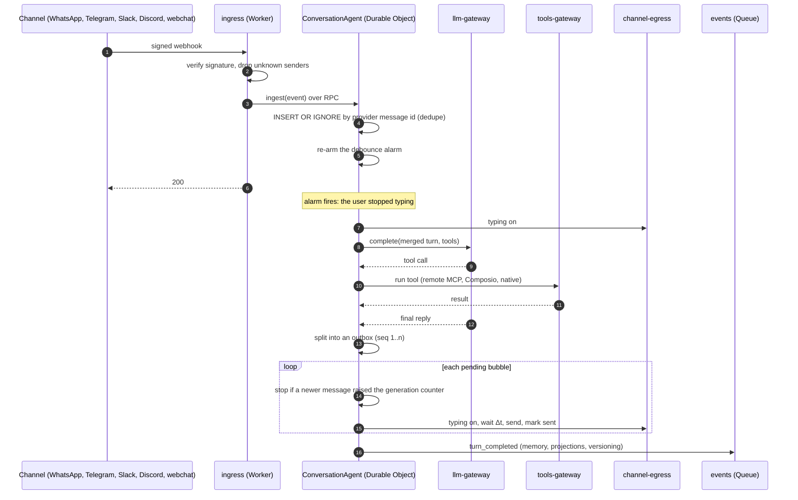

# Kelpie viability study

- **Date:** 2026-10-03
- **Status:** findings final. Each question had a decision issue under [Epic 1](https://github.com/guedesdiogo/kelpie/issues/1), and the owner decided all of them on 2026-10-03 ([§11](#11-decisions)).
- **Scope:** a single-tenant, self-hosted harness for internal use (see [§2](#2-scope)). The research started from a multi-tenant brief; the owner narrowed the scope while reviewing it.
- **Evidence:** eight research notes and one cross-check in [`docs/research/`](research/). Every claim below links to the note that sources it. The notes cite primary sources (official docs, source code pinned by commit, terms of service) and mark what could not be confirmed as *(unverified)*. They were written for the multi-tenant brief; where single-tenant changes a conclusion, this study says so.

## 1. Verdict

**Kelpie is viable on Cloudflare without containers.** Under the original multi-tenant brief, the cross-check rated 23 requirements: 8 viable as stated, 13 viable with changes, and 2 not viable as stated ([00 §3](research/00-cross-check.md#3-requirement-by-requirement-viability)). Narrowing to a single-tenant, internal-use harness removes most of the changes multi-tenancy demanded. It does not remove the two blockers:

1. **Logging in with a ChatGPT or Claude subscription is against both providers' terms on Cloudflare, even when only the owner uses it.** Serving colleagues breaks them a second time ([§8](#8-subscription-login)). The owner chose to offer it anyway as an opt-in restricted to the owner's own conversations, with the risk documented.
2. **User profiles can't live as versioned Markdown in GitHub or Obsidian**, because immutable git history conflicts with the right to erasure under the LGPD (Brazil's data protection law) and the GDPR ([02](research/02-memory-and-learning.md), [08](research/08-database-and-context-storage.md)). Colleagues are still data subjects.

The platform is not the hard part. The conversation engine (buffering, splitting, pacing, interruption) fits a Durable Object per conversation almost exactly. The hard parts are channel policies (WhatsApp's Business terms, Discord's gateway), the maturity of Jev, and keeping personal data where it can be erased.

**Feasible is not the same as deliverable by one person.** By our estimate, the full scope is several months of work. [§13](#13-delivery-plan) proposes a vertical slice first: for a portfolio, a working slice beats a complete architecture document.

## 2. Scope

**What Kelpie is.** It works like [Hermes Agent](https://github.com/NousResearch/hermes-agent), but serverless: no VPS, cheap to start and able to scale. One instance belongs to one owner, a person or a company. Each agent is like an extra employee. The owner and their work partners talk to the agents through chat channels; Kelpie is for internal use, not for answering leads.

**Requirements the owner added while reviewing the study:**

- **Allowlist, always.** Only users configured in advance can talk to an agent, and only through channel identities enabled for them (a Telegram account, a WhatsApp number, a Slack user). Everyone else is ignored before any model is called.
- **Permissions.** Each user has access to specific agents and specific content.
- **A task board for agents.** Agents log every piece of background work on Kelpie's own board, and people can queue tasks there and comment on them, but can't move a task once the agent has started it ([ADR-0011](adr/0011-agent-task-board.md)).
- **Conversational mode is a toggle.** Merging fragmented messages and splitting replies into paced bubbles can be switched on or off per agent.
- **Connectors are pluggable.** Each kind of external service (Postgres provider, Jev access path, model providers, channels, tool sources) starts with only the implementations the current phase needs, such as one Postgres provider and one Jev path, behind an interface and a config value that make adding another one straightforward.

**What single-tenant removes** compared with the research brief:

- tenant keys in every Durable Object name and every query;
- per-tenant envelope encryption of secrets: platform secrets (channel tokens, API keys) fit in Worker secrets and the Secrets Store (100 per account). Tokens stored per user, such as MCP OAuth tokens, are still encrypted at the application level ([§4.11](#411-tools));
- vendor ceilings shared by many tenants (they still apply to the one instance);
- Meta Tech Provider onboarding, which note 06 ties to serving other businesses' numbers ([06 §1.1](research/06-chat-channels.md)): a company running Kelpie on its own WhatsApp number should not need it (our inference; Meta's regular business verification may still apply);
- tenant onboarding, billing and cross-tenant reporting;
- one GitHub repository per tenant: one repository per instance.

**What stays:** many agents and agents orchestrating agents; many users with isolated personal memory, which colleagues must not read across; erasure rights for those users; and the Cloudflare constraints of [§4](#4-proposed-architecture).

## 3. What was studied

| Note | Topic |
|---|---|
| [00](research/00-cross-check.md) | Cross-check: contradictions resolved against primary sources, unverified claims ranked by impact, viability per requirement, gaps |
| [01](research/01-hermes-agent-and-bot-mode.md) | NousResearch Hermes Agent and Hermes Bot Mode, OpenClaw and Cloudflare's moltworker, read at pinned commits |
| [02](research/02-memory-and-learning.md) | akitaonrails/ai-memory, plus Letta, mem0, Zep/Graphiti, the Anthropic memory tool and the Agent Skills standard; a memory taxonomy |
| [03](research/03-tools-composio-mcp-invokta.md) | Composio, vinilana/invokta, MCP without containers, credentials, tool selection |
| [04](research/04-jev.md) | Jev (TypeSafe AI): API, access paths, cost, latency, privacy, and its fit at each decision point |
| [05](research/05-cloudflare-limits-and-architecture.md) | Cloudflare limits and pricing, hard constraints, Agents SDK, event-driven flow, worker decomposition, cost |
| [06](research/06-chat-channels.md) | WhatsApp, Telegram, Discord, Slack, webchat and others; capability matrix; Vercel Chat SDK |
| [07](research/07-llm-providers-and-auth.md) | Subscription-login terms, provider abstraction, current models and prices, cost control |
| [08](research/08-database-and-context-storage.md) | Database options, context storage and versioning, the Context Store worker, LGPD/GDPR, folder layout |

## 4. Proposed architecture

### 4.1 Requirements at a glance (current scope)

| Requirement | Verdict | What it takes |
|---|---|---|
| Single-tenant, many agents, agents orchestrating agents | Viable | Agents SDK sub-agents and agent tools; Workflows for long tasks |
| Allowlisted users, channel identities, per-user permissions | Viable | Checked in `ingress` before the conversation wakes up ([§4.6](#46-users-and-access-control)) |
| Mostly Cloudflare, no containers | Viable with changes | Rules out stdio MCP servers, the git CLI, unofficial WhatsApp libraries, Obsidian Headless and local terminal tools |
| Event-driven | Viable | Webhook → ingress → Durable Object for ordering and dedupe; Queues only for idempotent side effects |
| Buffer fragmented messages (toggle) | Viable | A Durable Object alarm, re-armed on every fragment, with a hard cap |
| Split one reply into paced messages with typing (toggle) | Viable with changes | Our own splitter and outbox; WhatsApp allows one message every 6 s per user, so [06 §9.3](research/06-chat-channels.md) recommends at most 3–4 bubbles there |
| Telegram, Slack, webchat | Viable | Webhooks (Telegram, Slack) and a hibernating WebSocket (webchat) |
| WhatsApp | Viable with changes | Official Cloud API only; agents with a bounded business role, because Meta's terms forbid general-purpose AI assistants ([§4.5](#45-channels)) |
| Discord | Viable with changes | Free text needs an always-on gateway connection in a Durable Object; otherwise slash commands only |
| Persona, skills and agent knowledge as versioned, editable Markdown | Viable with changes | A Context Store worker over a private GitHub repository |
| User profiles as Markdown in GitHub or Obsidian | **Not viable as stated** | Personal data in a Durable Object per user plus R2, exposed as virtual Markdown files |
| Editable in Obsidian | Viable with changes | obsidian-git on desktop against the instance repository |
| Dedicated versioning worker | Viable with changes | The Context Store is the only component that talks to GitHub; commits are batched |
| Composio | Viable with changes | One adapter behind our own tool interface |
| Any MCP server | Viable with changes | Remote servers only; stdio needs a bridge the owner hosts |
| Jev as the preferred qualifier | Viable with changes | Used when configured, never required; a keyless heuristic is the out-of-the-box default |
| OpenAI and Anthropic via API key | Viable | Native adapters through AI Gateway |
| Subscription login | **Against both providers' terms** | Owner-only opt-in, off by default, risk documented ([§8](#8-subscription-login)) |
| A database beyond D1 | Viable | Postgres via Hyperdrive alongside Durable Object SQLite |
| Management UI inspired by Hermes Bot Mode | Viable with changes | Reuse the UX patterns; add users, permissions, audit and approvals |
| Public open-source portfolio | Viable with changes | Installs and runs CI with no third-party keys (the qualifier falls back to heuristics; running agents still needs a model key and a database); demos on test numbers; synthetic fixtures only; the README states what is excluded and why |

### 4.2 The hot path: one Durable Object per conversation

Queues have no ordering guarantee and Workflows add a hop per step (their latency per step is *(unverified)*), so neither fits a chat turn ([05 R9; "Step by step and decisions", item 4](research/05-cloudflare-limits-and-architecture.md)). A Durable Object per conversation gives ordering, mutual exclusion, strongly consistent SQLite and millisecond alarms in one place:

- **Dedupe:** a unique provider message id in the Durable Object's SQLite. The provider's own webhook retries are the retry mechanism ([05 "Step by step and decisions", item 2](research/05-cloudflare-limits-and-architecture.md)).
- **Debounce:** an alarm re-armed per fragment, never `setTimeout`. A pending timer keeps the object from hibernating and is billed; the docs list no such effect for a scheduled alarm ([00 C2](research/00-cross-check.md)). With conversational mode off, a turn starts on each message.
- **Durable turns:** the Agents SDK's fibers and a persisted outbox survive eviction. Recovery resends only bubbles still marked `pending` ([05 R5](research/05-cloudflare-limits-and-architecture.md)).
- **Interruption:** a new message raises a generation counter. The in-flight model call is aborted, unsent bubbles are cancelled, and the next turn is told what was already said. The policy is configurable per agent: preempt-and-merge (default), queue, or hybrid ([05 "Hard cases"](research/05-cloudflare-limits-and-architecture.md), [01 TL;DR 8](research/01-hermes-agent-and-bot-mode.md)).
- **Pacing:** in-memory timers during the active turn, a per-recipient token bucket, and per-channel bubble caps. Note 05's schedule of 30–50 ms per character ignores WhatsApp's pair limit; note 06's tighter clamp plus the cap applies ([00 §1C item 4](research/00-cross-check.md)).

### 4.3 Workers

About ten Workers, each with a narrow job ([05 "Decomposition into workers"](research/05-cloudflare-limits-and-architecture.md), adapted to single-tenant):

| Worker | Job |
|---|---|
| `ingress` | Verify signatures, normalize to a canonical event, filter delivery receipts, drop senders who are not allowlisted, route to the conversation |
| `conversation-runtime` | `ConversationAgent` (buffer, turn, splitter, outbox, interruption) and one `AgentHost` per agent (config, MCP connections, schedules, budget) |
| `channel-egress` | Send, typing, media and per-channel rate limits |
| `llm-gateway` | Provider adapters over AI Gateway, streaming, token accounting |
| `tools-gateway` | Tool registry, remote MCP, Composio, credential injection |
| `context-store` | Read and write the Markdown context, filtered by the user's permissions; the only component that talks to GitHub |
| `memory-jobs` | Post-turn extraction, embeddings, consolidation |
| `projector` | Event projections into Postgres for the UI and search |
| `admin-api` / `admin-ui` | Management API and single-page app |

Service-binding RPC carries synchronous calls, Queues carry side effects, and Workflows carry long work. The longest hot-path chain is three hops, far below the 32-invocation limit ([05 R7](research/05-cloudflare-limits-and-architecture.md)).

### 4.4 Runtime foundation: the Agents SDK `Agent` class

`ConversationAgent` and `AgentHost` extend the Agents SDK's `Agent`. It already handles the one-alarm-per-object limit with multiplexed schedules, and it provides durable fibers with idempotency keys, a remote MCP client with OAuth, sub-agents and the Workflows bridge. The SDK moves fast (v0.3.7 in February 2026, v0.26 in October), so versions are pinned and the domain logic (`Buffer`, `Splitter`, `Outbox`, `InterruptPolicy`) lives in plain modules with no SDK imports. The Think and Messengers layers are not used: Messengers supports only Telegram and replies by editing one streamed message, which contradicts separate paced bubbles ([05 "Agents SDK: use it or not"](research/05-cloudflare-limits-and-architecture.md), [00 §4 item 12](research/00-cross-check.md)).

### 4.5 Channels

Kelpie defines its own adapter interface, inspired by the Vercel Chat SDK, rather than adopting it. The Chat SDK's debounce is a `sleep()` inside the handler, which does not survive a restart, and its adapters are in beta ([06 §8](research/06-chat-channels.md)).

| Channel | Inbound | Typing indicator | Constraint that decides |
|---|---|---|---|
| Webchat | WebSocket on a hibernating Durable Object | Both directions | None; best fit |
| Telegram | Webhook with `secret_token` | Up to 5 s, renewed | About 1 message/s per chat |
| WhatsApp Cloud API | Webhook with HMAC | Up to 25 s, and it marks the message as read | 1 message every 6 s per user; 24 h service window; Meta's terms §4.7 forbid AI providers whose AI is the main function rather than "incidental or ancillary" ([06 §1.1](research/06-chat-channels.md)) |
| Slack | Events API (ack within 3 s) | None for bots; `assistant.threads.setStatus` instead | 1 message/s per channel |
| Discord | Gateway WebSocket for free text; Interactions for commands | 10 s, renewed | An always-on Durable Object per bot, with a watchdog alarm |

For WhatsApp, §4.7 means an agent there should have a bounded business role (scheduling, support triage, an internal helpdesk), not act as a general-purpose assistant; general assistants fit Telegram, Slack or webchat. Unofficial WhatsApp libraries (Baileys and similar) are excluded: they need a long-lived socket, they break WhatsApp's terms, and the number gets banned ([06 §1.2](research/06-chat-channels.md)).

### 4.6 Users and access control

New in this scope and not covered by the research notes. The owner approved this model in [Decision 1.12](https://github.com/guedesdiogo/kelpie/issues/13):

- **Users** are created by the owner or an admin. Each user has one or more **channel identities** (Telegram user id, WhatsApp number, Slack user id, webchat login), enabled one by one.
- **Grants** say which agents a user may talk to and which content scopes (shared knowledge folders, an agent's private notes) they may read or edit.
- **Enforcement points:**
  - `ingress` drops any message whose identity is not enabled, before a conversation wakes or a model is called; this doubles as spam protection. It reads a `Directory` Durable Object, not Postgres or KV: Neon scales to zero and KV can lag by up to 60 s ([05 R10](research/05-cloudflare-limits-and-architecture.md)), while the Directory is strongly consistent, so a revocation applies to the next message;
  - the `ConversationAgent` checks the user's grant for the agent;
  - the Context Store filters what goes into the context by the user's content scopes;
  - memory is per user.
- **Groups** are the hard case. Our rule: in a group chat, an agent may only use memories every participant is allowed to see, otherwise one colleague's facts leak to another. Note 02 also proposes a separate group scope for facts that belong to the group itself ([02 §5.2](research/02-memory-and-learning.md)).

### 4.7 Data

The owner chose Postgres as the system of record and a Durable Object per user for personal data ([Decision 1.5](https://github.com/guedesdiogo/kelpie/issues/6), [Decision 1.3](https://github.com/guedesdiogo/kelpie/issues/4)):

| Data | Where |
|---|---|
| Conversation state: recent messages, turns, outbox, schedules | Durable Object SQLite, one per conversation |
| Users, channel identities, grants, agents, channels, audit, projections | Postgres via Hyperdrive (Neon first; other providers by configuration). The hot path reads identities and grants from a `Directory` Durable Object kept in sync by the admin API |
| User profile, facts and episodes (personal data) | A Durable Object per user, plus R2 for larger files; retrieval through FTS5 in that object and Vectorize |
| Routing cache (channel identity → user and agent) | KV |
| Media and archives | R2 |
| Operational metrics | Analytics Engine |
| Persona, skills, agent knowledge | Context Store ([§4.8](#48-context-the-context-store-worker)) |

Erasing a user is a workflow across stores: the user's Durable Object storage, R2 objects and vectors; their messages in conversation Durable Objects and R2 archives; their identity, grant and projection rows in Postgres, with audit rows pseudonymized; and their KV routing entries. Some copies stay out of reach for a while: Durable Object point-in-time recovery keeps deleted data for 30 days, and model providers keep logs and backups under their own terms ([08 "LGPD/GDPR"](research/08-database-and-context-storage.md), [02 §3.6, §5.3](research/02-memory-and-learning.md)). This choice gives up the single transactional `DELETE` that keeping personal data in Postgres would have allowed, which the cross-check preferred once Postgres was in scope ([00 §1C item 1](research/00-cross-check.md)). Two Hyperdrive facts set the database rules: its query cache is on by default and is not invalidated by writes, and its pool runs in transaction mode. Data that changes per user goes through a cache-disabled binding ([00 C11](research/00-cross-check.md)).

### 4.8 Context: the Context Store worker

Agents never talk to GitHub. They read and write through the Context Store, which keeps a working copy in a Durable Object (read-your-writes) and treats a private GitHub repository as canonical:

- **Writes** are batched into a single `createCommitOnBranch` GraphQL mutation with `expectedHeadOid` for optimistic concurrency. GitHub allows about 80 content-creating requests per minute and 500 per hour, so batching is required even for one instance ([08](research/08-database-and-context-storage.md), [00 C12](research/00-cross-check.md)).
- **Human edits** arrive through the push webhook and merge three-way per file. GitHub does not redeliver failed webhooks, so a reconciliation cron runs as well.
- **Persona, rules and skills** change only through pull requests a human approves.
- **Obsidian** works through the obsidian-git plugin on desktop, pointed at the repository. Obsidian Sync has no public API, and its headless client is a Node CLI that can't run in Workers.
- **Cloudflare Artifacts** (Git-compatible storage for agents) exists, but it entered open beta on 2026-10-01, its binding is read-only, and it has no documented mirror to GitHub. It sits behind the same backend interface as a later option ([08 "R2, isomorphic-git and Artifacts"](research/08-database-and-context-storage.md), [00 C15](research/00-cross-check.md)).

### 4.9 Memory and learning

The field has converged on versioned Markdown files as the source of truth, a derived index for retrieval, and consolidation in the background (Letta's MemFS, Hermes, ai-memory, the Anthropic memory tool). Contradictions are handled by superseding a memory, not deleting it ([02 TL;DR](research/02-memory-and-learning.md)).

| Memory | What it is | Where it lives |
|---|---|---|
| Working | The current conversation | Conversation Durable Object |
| Episodic | Summaries of past conversations | The user's Durable Object, deletable |
| Semantic | Facts about users and the domain | User facts in the user's Durable Object; domain knowledge as Markdown in git |
| Procedural | Skills, in the [Agent Skills](https://agentskills.io) `SKILL.md` format | Git, staged and merged by pull request |
| Identity | Agent persona; user profiles | Persona in git; profiles in the user's Durable Object, never in git |
| Group | Facts that belong to a group conversation | A group scope visible only to that group's members ([02 §3.2](research/02-memory-and-learning.md)) |

Learning runs on three rhythms ([02 §6](research/02-memory-and-learning.md)): after a conversation goes idle (episode and user facts, automatic), on a schedule per agent (knowledge and skills, staged with evidence and a pull request), and weekly (a curator that archives stale skills and never deletes). Hermes's background review costs about 30k tokens per event ([01 TL;DR 4](research/01-hermes-agent-and-bot-mode.md)), so Kelpie runs it on a cheap model over a digest.

Anything headed for git passes a personal-data gate before every commit, not at merge time, because a pull-request branch already writes git history ([02 §5.3](research/02-memory-and-learning.md)). Memory poisoning through prompt injection is designed against from day one: stored content is treated as untrusted, writes are scoped by blast radius, and only a human promotes anything into persona or rules ([02 §5.1](research/02-memory-and-learning.md)).

### 4.10 Models

`LlmProvider` is a thin interface of our own with native adapters for Anthropic Messages and OpenAI Responses. It is not a lowest-common-denominator Chat Completions layer, because OpenAI's current models need the Responses API for tool calling (07; partly verified, [00 §2B item 8](research/00-cross-check.md)). Traffic goes through AI Gateway in passthrough mode with the key sent per request and `byok_only` on, so a missing key fails instead of silently billing Cloudflare credits. Fallback between providers lives in Kelpie's `ModelRouter`, because AI Gateway's Dynamic Routing accepts only the Chat Completions shape and needs stored keys ([07 §2](research/07-llm-providers-and-auth.md), [00 C5](research/00-cross-check.md)). A budget in a Durable Object reserves the worst case before each call and settles with real usage afterwards. To keep cost low, the model router sends most turns to a cheap tier and uses prompt caching.

### 4.11 Tools

`ToolProvider` has three adapters: remote MCP, Composio and native Workers tools ([03](research/03-tools-composio-mcp-invokta.md)).

- **MCP:** in the official MCP Registry on 2026-10-03, 62.7% of active entries had a remote endpoint and 36.1% were package-only, usually stdio. Remote servers connect through the Agents SDK client. That client stores OAuth tokens unencrypted, so tokens live in a Durable Object per user with application-level encryption ([00 C10](research/00-cross-check.md)).
- **Composio:** used in "harness integration" mode, where Kelpie's loop decides and Composio authenticates and executes. Composio keeps custody of the OAuth tokens and does not export them.
- **Selection:** a BM25 or embedding pre-filter, then Jev to qualify, abstain and flag risk, then deferred loading of the chosen tool schemas.

## 5. Where Jev fits

Jev is TypeSafe AI's decision model. It does not generate text: it takes a state and typed questions (`noul` for yes/no, `choice` over up to 255 options, `score` on a rubric of 2–10 levels) and returns probabilities that TypeSafe says are calibrated ([04 §1](research/04-jev.md)). Third parties found it systematically overconfident on at least one dataset ([04 §2.6](research/04-jev.md)). It launched on 2026-09-15.

**Access paths.** The owner chose to start with the Workers AI binding, with the interface ready for the TypeSafe API and OpenRouter, and Jev preferred but never required ([Decision 1.4](https://github.com/guedesdiogo/kelpie/issues/5)):

| Path | Credential | Ceiling | Privacy |
|---|---|---|---|
| Workers AI binding, `env.AI.run('typesafe/jev')` (first) | Cloudflare Unified Billing credits, plus a 5% fee | 200 requests per 60 s per gateway. Because a fragmented message can cost 3–4 calls, that is roughly 50–65 user turns per minute ([00 C4](research/00-cross-check.md)): enough for internal use | Zero data retention in the catalog; gateway logging must be turned off separately. Pinning a model version on this path is *(unverified)* |
| TypeSafe API | TypeSafe key; early access with a waitlist at launch | 80 requests/s, about 20 fan-out calls/s | No zero retention below enterprise; perpetual telemetry license |
| OpenRouter | OpenRouter key, no waitlist ([00 C7](research/00-cross-check.md)) | *(unverified)* | Per OpenRouter's terms |

**Where to use it** ([04 §4](research/04-jev.md)). The rules: one synchronous fan-out call per turn holding every hot-path question, an 800 ms timeout, a `none` option in every `choice`, instructions in English, and personal data masked before it leaves.

| Decision | Use Jev? | Notes |
|---|---|---|
| End of turn: has the user finished typing? | Yes, hybrid | A cheap speculative call about 1–1.5 s after the last fragment; the full fan-out goes out once the user looks done, so a "finished" answer adds little latency ([04 §4.2](research/04-jev.md)) |
| Which tools | Yes | `choice` over the catalog, then top-k. Whether `choice` probabilities support a cumulative-probability cutoff or only a ranking is unsettled between notes 02 and 04; measure it |
| Which skills | Yes | TypeSafe's benchmark cut wrong skill loads from 16.8% to 7.3%, on synthetic data |
| Which memories | Yes, as a reranker | After vector search. ai-memory measured hit@1 rising from 0.50 without reranking to 0.78 with Jev on a coding-agent wiki ([02 §1.8](research/02-memory-and-learning.md)) |
| Which model tier | Yes | Cheap, medium or frontier, decided in code from the probabilities |
| Should the bot answer in a group? | Only when ambiguous | Mentions, replies and DMs are decided by rules first |
| Which sub-agent | Yes | Same shape as skills |
| Write a permanent memory; detect contradictions | Yes, off the hot path | The LLM extracts; Jev qualifies |
| Escalate to a human | Yes | Combined with counters in code |
| Which conversations to review | Yes, off the hot path | Rubric scores rank conversations for learning |
| Prompt-injection screening | One layer only | Alongside Prompt Guard / Llama Guard and structural defenses; TypeSafe says adversarial content moves its answers |
| Review a reply before sending | Selectively | Only when the turn used tools with side effects |
| Where to split a reply into bubbles | No | It adds latency to every reply, and channel rules decide it anyway |

**Other moments worth adding** ([04 §4.4](research/04-jev.md)): authorizing tools with side effects (execute, confirm with the user, or refuse); asking for missing information before acting; choosing what to drop when compacting context; stopping a looping agent; moderation in group channels before the agent wakes; judging whether a transcribed voice note or image is relevant; deciding whether a proactive follow-up is welcome; routing known intents to deterministic flows; and deciding what to do with a message that arrives mid-turn (steer, queue, or cancel and restart).

**Risks:** the product is 18 days old; no one has measured it in Portuguese (on two tasks in Spanish, third parties saw 3–6 points less accuracy and about twice the calibration error); its latency from Brazil is unmeasured; and its terms forbid training a model to imitate its output, so the fallback can't be distilled from it ([04 §6](research/04-jev.md)).

## 6. Database options

The owner asked for options beyond D1 and chose Neon first, with other Postgres providers selectable by configuration and the "100% Cloudflare" profile dropped ([Decision 1.5](https://github.com/guedesdiogo/kelpie/issues/6)). The options, from [08 (A)](research/08-database-and-context-storage.md):

| Option | Free tier for a demo | Verdict |
|---|---|---|
| **Neon + Hyperdrive** | 100 projects, scale-to-zero, no weekly pause, pgvector, branching | **First provider** |
| Supabase + Hyperdrive | Pauses after a week without use | Second provider by configuration |
| PlanetScale Postgres + Hyperdrive | None; from US$ 5/month, billed by Cloudflare | Production upgrade path by configuration |
| Durable Object SQLite | 5 GB total | Hot state and per-user personal data, alongside Postgres |
| D1 | 10 databases, 500 MB each | Not used |
| Turso (libSQL) | 100 databases | Not used: Durable Object SQLite gives the same pattern without another vendor |
| Cloudflare-managed Postgres | — | Does not exist; the PlanetScale partnership is the closest |

All three Postgres providers sit behind Hyperdrive, so switching is mostly a connection string. Provider-specific features stay usable where an adapter needs them.

## 7. Reference projects: what to take

| Project | Take | Leave |
|---|---|---|
| [Hermes Agent](https://github.com/NousResearch/hermes-agent) | Memory files with character budgets, frozen into the prompt per session; Agent Skills with progressive disclosure; background review forks; the skill curator; profiles as isolated agents; `interrupt` / `queue` / `steer` for busy agents | A long-running Python process with a local filesystem and terminal tools. Its batching waits 0.3 s, which suits pasted text, not people typing in bursts, and it splits replies only by length ([01](research/01-hermes-agent-and-bot-mode.md)) |
| [Hermes Bot Mode](https://github.com/NousResearch/Hermes-Bot-Mode) | UX: bot roster, "forever chat", routines, group rooms of 2–6 bots, bot-to-bot messages | Archived on 2026-08-16; it now lives as a plugin in the hermes-agent desktop app and has no user, permission or credential layer |
| [ai-memory](https://github.com/akitaonrails/ai-memory) | Git-backed Markdown as truth with a derived index; capture without an LLM; audited self-improvement with staging and optional approval; tiered decay; supersession; a measured Jev reranker | Single-user by design (reads are not filtered by author), a Rust binary on a local filesystem ([02 §1](research/02-memory-and-learning.md)) |
| [invokta](https://github.com/vinilana/invokta) | One pipeline (validate, authorize, execute, validate output); a closed error taxonomy; a missing grant returns `FORBIDDEN` with an authorization URL; credential resolution per call | Learn from it, don't depend on it. It exposes your capabilities as an MCP server (inbound) while Kelpie consumes third-party tools (outbound), and it is two months old with one maintainer ([03](research/03-tools-composio-mcp-invokta.md)) |
| [OpenClaw](https://github.com/openclaw/openclaw) | Block streaming: a paragraph → line → sentence chunker with a human delay between blocks; per-channel debounce | — |
| [moltworker](https://github.com/cloudflare/moltworker) | Evidence: running OpenClaw on Cloudflare needed a Sandbox container, which is why Kelpie is webhook-first | The container |

## 8. Subscription login

The owner asked whether Kelpie could use a ChatGPT or Claude subscription the way Hermes Agent does. The research and a check of Hermes's code (commit `5d3c059`) give this picture:

- **Anthropic.** Its [legal page](https://code.claude.com/docs/en/legal-and-compliance) reserves subscription OAuth for Claude Code and Anthropic's own apps, says developers "may not collect, store, or intermediate Claude.ai credentials or session tokens", and forbids routing requests through Free, Pro or Max credentials on behalf of users. Hermes uses what its own code calls the "Claude Code OAuth identity", and it can fall back to Claude Code's stored credentials ([anthropic_credentials.py](https://github.com/NousResearch/hermes-agent/blob/5d3c05977bb3c8b7cfd6b3e39d96f6e35a9e0662/agent/anthropic_credentials.py)). Hermes's docs say that path works only on Max with purchased "extra usage" credits and never draws on the plan's allowance ([providers.md](https://github.com/NousResearch/hermes-agent/blob/5d3c05977bb3c8b7cfd6b3e39d96f6e35a9e0662/website/docs/integrations/providers.md)). No note priced those credits against an API key. Whether Anthropic has acted against Hermes is *(unverified)*; according to a secondary source (The Register), OpenCode removed the same feature in February 2026, citing a legal request ([07 §1.1](research/07-llm-providers-and-auth.md)).
- **OpenAI.** Its Sign in with ChatGPT developer docs open plan usage to open-source projects that run locally and ask paid or remotely hosted apps to join a waitlist. The [terms](https://openai.com/policies/sign-in-with-chatgpt-terms/) require tokens to be stored locally under the user's control, "not in a remote or managed environment", and forbid another user's activity from triggering requests on the subscriber's account ([07 §1.2](research/07-llm-providers-and-auth.md); the terms page refused automated access during the cross-check, so this reading rests on note 07). Hermes identifies itself honestly when it calls the official Codex endpoint ([codex_headers.py](https://github.com/NousResearch/hermes-agent/blob/5d3c05977bb3c8b7cfd6b3e39d96f6e35a9e0662/agent/codex_headers.py)), but it signs in through the Codex device-code login rather than the Sign in with ChatGPT flow, so whether those terms govern it is *(unverified)*.
- **Kelpie.** It runs on Cloudflare rather than the owner's machine, which by itself puts subscription login outside both providers' terms, even when only the owner uses it: Anthropic reserves the OAuth for Claude Code, and storing a refresh token in a Durable Object breaks OpenAI's local-storage condition ([07 §1.4](research/07-llm-providers-and-auth.md)). Serving colleagues breaks both providers' terms a second time. The one reading that may fit OpenAI's terms is a local companion on the owner's machine that keeps the refresh token and hands short-lived access tokens to the owner's own instance, used only for the owner's own conversations; OpenAI's waitlist for remotely hosted apps may still apply. That is our reading, not legal advice.

**Owner decision ([Decision 1.2](https://github.com/guedesdiogo/kelpie/issues/3)):** offer subscription login as a Hermes-style opt-in, restricted to the owner's own conversations, off by default, with the policy conflict and the risk of account suspension documented in the README. Colleagues always go through API keys. Version 1 ships API keys only; the opt-in comes in a later phase.

## 9. Risks

| Risk | Mitigation |
|---|---|
| Agents SDK churn: experimental APIs, deprecations, fast releases | Pinned versions, domain code without SDK imports, contract tests, an ADR per upgrade |
| Jev maturity, Portuguese calibration and latency from Brazil | Fallback path, circuit breaker, a labeled PT-BR set per decision before automatic mode |
| Memory poisoning through injected content | Stored content treated as untrusted; writes scoped by blast radius; promotion to persona or rules only by a human |
| Leakage between colleagues, especially in group chats | Memory per user, content scopes in the Context Store, group-safe memory selection, adversarial tests |
| Subscription opt-in: account suspension, reputational exposure in a public repository | Off by default, owner-only, risk stated in the README; the Anthropic path conflicts with Anthropic's written policy |
| Cost steps: Durable Object duration billed in US$ 12.50 increments, Code Mode per unique Worker | Alarms instead of timers; measure duration in the dashboard; Code Mode only where it pays |
| WhatsApp policy | Bounded business roles for WhatsApp agents; general assistants on other channels |

## 10. Cost

For one instance, three agents and 2,000 inbound messages a day, excluding model, Postgres, Meta and Composio charges ([05 "Estimated cost (small scenario, no LLM)"](research/05-cloudflare-limits-and-architecture.md); the single-tenant scope matches the one-tenant scenario costed there):

| Scenario | Monthly |
|---|---|
| Recommended architecture, everything within the included usage | About US$ 5 (the Workers Paid plan) |
| Durable Objects that fail to hibernate | About US$ 18 |
| Stress: Discord gateway, a Workflow per turn, a commit per turn in Artifacts | About US$ 30–45 |
| Code Mode on every turn | About US$ 78 more |

The US$ 5 baseline assumes a scheduled alarm does not keep a Durable Object awake. A spike on 2026-10-03 confirmed it: an object waiting 20 minutes on an alarm accrued no duration until the alarm fired on schedule, while one waiting on `setTimeout` accrued duration for about 15 minutes and then was evicted with its timer lost ([spike](spikes/do-alarm-hibernation.md)).

## 11. Decisions

Each decision is closed by an ADR in `docs/adr/` once its pull request merges.

| Decision | Status |
|---|---|
| [1.11 Tenancy](https://github.com/guedesdiogo/kelpie/issues/12) | **Decided:** single-tenant, self-hosted, internal use |
| [1.2 LLM authentication](https://github.com/guedesdiogo/kelpie/issues/3) | **Decided:** API keys in v1; owner-only subscription opt-in later ([§8](#8-subscription-login)) |
| [1.3 Personal data](https://github.com/guedesdiogo/kelpie/issues/4) | **Decided:** a Durable Object per user plus R2, outside git |
| [1.4 Jev](https://github.com/guedesdiogo/kelpie/issues/5) | **Decided:** preferred, never required; Workers AI binding first, TypeSafe and OpenRouter ready |
| [1.5 Database](https://github.com/guedesdiogo/kelpie/issues/6) | **Decided:** Neon via Hyperdrive first; other Postgres providers by configuration |
| [1.6 Context Store](https://github.com/guedesdiogo/kelpie/issues/7) | **Decided:** the recommended default ([§4.8](#48-context-the-context-store-worker)) |
| [1.7 Runtime foundation](https://github.com/guedesdiogo/kelpie/issues/8) | **Decided:** the recommended default ([§4.2](#42-the-hot-path-one-durable-object-per-conversation)–[§4.4](#44-runtime-foundation-the-agents-sdk-agent-class)) |
| [1.8 Channels](https://github.com/guedesdiogo/kelpie/issues/9) | **Decided:** the recommended default ([§4.5](#45-channels)) |
| [1.9 License](https://github.com/guedesdiogo/kelpie/issues/10) | **Decided:** MIT |
| [1.10 MVP scope and phases](https://github.com/guedesdiogo/kelpie/issues/11) | **Decided:** approved as proposed ([§13](#13-delivery-plan)) |
| [1.12 Access control](https://github.com/guedesdiogo/kelpie/issues/13) | **Decided:** approved as proposed ([§4.6](#46-users-and-access-control)) |
| [4.1 Agent task board](https://github.com/guedesdiogo/kelpie/issues/44) | **Decided:** Kelpie's own board, not GitHub Issues ([ADR-0011](adr/0011-agent-task-board.md)) |

## 12. Spikes before committing to a design

- ~~Does a scheduled alarm let a Durable Object hibernate?~~ Yes: the US$ 5 baseline holds ([spike](spikes/do-alarm-hibernation.md)).
- What are Jev's latency from Brazil and its accuracy on informal PT-BR end-of-turn detection?
- Does `createCommitOnBranch` work from a Worker through a GitHub App?
- Does OpenAI Responses streaming pass through AI Gateway passthrough?
- Before WhatsApp: does re-sending the typing indicator work between bubbles?
- Before Discord free text: does a gateway Durable Object stay resident for 24 h with only the watchdog alarm (logging evictions)?

## 13. Delivery plan

The owner approved this plan in [Decision 1.10](https://github.com/guedesdiogo/kelpie/issues/11).

| Phase | Scope |
|---|---|
| 0. Foundations | Monorepo, CI, ADRs, a local workerd test harness for alarms and fibers |
| 1. Vertical slice | Webchat and Telegram; allowlisted users with channel identities; `ConversationAgent` with buffer, splitter, outbox and interruption, conversational mode as a toggle; Anthropic and OpenAI by API key; Context Store with GitHub for persona and skills; heuristic qualifier with optional Jev; a minimal admin API |
| 2. Memory and tools | Per-user memory with supersession and Jev qualification; remote MCP and Composio; Slack; WhatsApp on a test number; per-agent and per-content grants |
| 3. Agents and UI | Agents orchestrating agents; the management UI inspired by Bot Mode; skill staging by pull request and the curator; the subscription opt-in; Discord gateway |
| 4. Hardening | Evals and golden sets, cross-worker tracing, the Artifacts backend |

## 14. Open questions no note answered

From [00 §4](research/00-cross-check.md#4-gaps-important-questions-none-of-the-notes-answered), adjusted to the current scope, plus our own:

- An end-to-end latency budget for one WhatsApp turn (debounce, Jev, model, pacing).
- Voice notes and images, which are very common on WhatsApp in Brazil: transcription model, cost, quality.
- Admin authentication for the management UI, and how users see and correct their own memory (an LGPD access right).
- Channel onboarding: connecting each channel and pairing a user's identity safely.
- Data residency: Durable Object jurisdiction, provider retention terms.
- Test strategy: recorded channel payloads, deterministic race tests for debounce, interruption and outbox.
- Tracing a turn across Workers, with per-turn cost and PII redaction.
- Proactive messages outside WhatsApp's 24 h window (paid templates).
- Licenses and attribution for borrowed patterns and prompts.
- An upgrade policy for the Agents SDK.
- The admin UI stack.
- Monorepo tooling.
